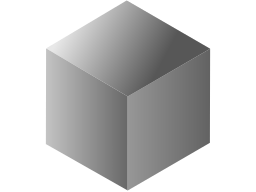
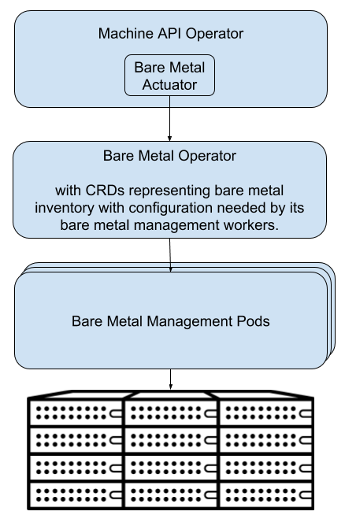

# MetalKube Documentation



The MetalKube project exists to provide components that allow you to do bare
metal host management for Kubernetes.  MetalKube works as a Kubernetes
application, meaning it runs on Kubernetes and is managed through Kubernetes
interfaces.

[Operators](https://github.com/operator-framework/operator-sdk) are a key piece
of the MetalKube architecture as the method used to manage kubernetes
applications.

## MetalKube Component Overview

### Machine API Integration

Another set of components is being designed and built to provide integration
with the Kubernetes [Machine
API](https://github.com/kubernetes-sigs/cluster-api).

This first diagram represents the high level architecture:



#### Machine API Actuator

The first component is the [Bare Metal
Actuator](https://github.com/metalkube/cluster-api-provider-bare-metal).  This
is the component with logic specific to this architecture for handling changes
to the lifecycle of Machine objects.  This actuator may be integrated with the
existing [Machine API
Operator](https://github.com/openshift/machine-api-operator) or some other
implementation of the cluster API.

This actuator will associate Machine objects with a bare metal host from the
inventory of bare metal hosts managed by the Bare Metal Operator.

#### Bare Metal Operator

The architecture also includes a new [Bare Metal
Operator](https://github.com/metalkube/bare-metal-operator), which includes the
following:

* A Controller for a new Custom Resource, BareMetalHost.  This custom resource
  represents an inventory of known (configured or automatically discovered)
  bare metal hosts.  When a Machine is created the Bare Metal Actuator will
  claim one of these hosts to be provisioned as a new Kubernetes node.
* In response to BareMetalHost updates, will perform bare metal host
  provisioning actions as necessary to reach the desired state.  It will do so
  by managing and driving a set of underlying bare metal provisioning
  components.
* The implementation will focus on using Ironic as its first implementation of
  the Bare Metal Management Pods, but aims to keep this as an implementation
  detail under the hood such that alternatives could be added in the future if
  the need arises.

The creation of the BareMetalHost inventory can be done in two ways:

1. Manually via creating BareMetalHost objects.
2. Optionally, automatically created via a bare metal host discovery process.
   Ironic is capable of doing this, which will also be integrated into
   MetalKube as an option.

## APIs

1. Enroll nodes by creating BareMetalHost resources.  This would either be
   manually or done by a component doing node discovery and introspection.

   See the documentation in the
   [baremetal-operator](../baremetal-operator) repository for details.

2. Use the machine API to allocate a machine.

```
apiVersion: "cluster.k8s.io/v1alpha1"
kind: Machine
metadata:
    generateName: baremetal-master-
    labels:
        set: master
spec:
    providerConfig:
        value:
            apiVersion: "baremetalproviderconfig/v1alpha1"
            kind: "BareMetalProviderConfig"
            selector:
                node-profile: master


apiVersion: "cluster.k8s.io/v1alpha1"
kind: Machine
metadata:
    generateName: baremetal-node-
    labels:
          set: node
spec:
    providerConfig:
        value:
            apiVersion: "baremetalproviderconfig/v1alpha1"
            kind: "BareMetalProviderConfig"
            selector:
                node-profile: node
```

3. Machine is associated with an available BareMetalHost, which triggers
   provisioning of that host to join the cluster.  (Exact mechanism for this
   association is TBD).
