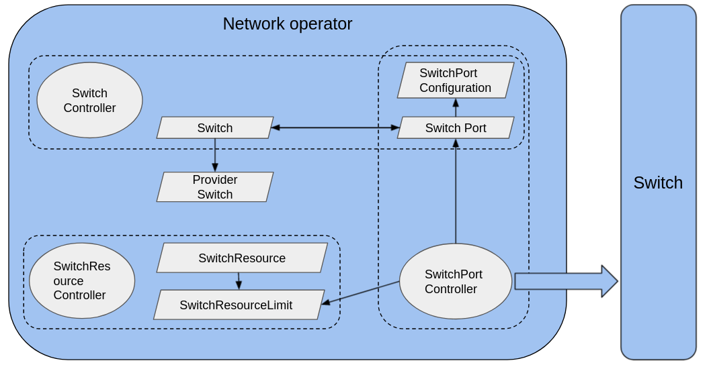

# Automatic network configuration

## Status

provisional

## Summary

This proposal is to expand the scope of Metal³ to include an API to
manage physical network devices.

## Motivation

Metal³ follows the paradigm of Kubernetes Native Infrastructure (KNI),
which is an approach to use Kubernetes to manage underlying infrastructure.
Managing the configuration of some physical network devices is closely
related to managing physical hosts. As bare metal hosts are provisioned
or later repurposed, there may be corresponding physical network changes
that must be done, such as reconfiguring a ToR switch port. If the provisioning
of the physical host is managed through a Kubernetes API, it would be
convenient to be able to reconfigure related network devices using a
similar API.

## Goals

- Define a Kubernetes API for configuring network devices.
- Automatically configure the network infrastructure for a host when
  adding it to a cluster.
- Do network configuration when deprovisioning the hosts.
- Design a network abstraction that can represent any of the target networking
  configuration, independently of the controller used.

## Non-Goals

- Implement a network controller which is aimed at being an integration with
  an existing controller only.
- Implement a solution for a specific underlying infrastructure.
- Implement a solution for link aggregation.
- It is not a goal (of this spec) to configure the software running on the Host to
  connect to the right networks on the right ports.

## Proposal

This document proposes to add a new mechanic to automatically perform physical
network device configuration when consuming a bmh.
There will be a new operator and a series of CRDs staying in a new separate
repository, and relative changes to CAPM3 and BMO.

### User Stories

#### Story 1

As the administrator of Metal³, I hope that the machine can be automatically
connected to the provisioning network before provisioning.

#### Story 2

As a administrator of Metal³, I hope that the machine can be automatically removed
from the provisioning network after provisioning is completed.

#### Story 3

As a user of Metal³, I hope that the machine can be automatically connected
to the network I specified after provisioning is completed.

#### Story 4

As the administrator of Metal³, I hope that the machine can be automatically
connected to the provisioning network before deprovisioning.

#### Story 5

As a user of Metal³, I hope that when the machine is removed from the cluster,
the network configuration made to the relative network device for this machine
will also be automatically cleared.

## Design Details

### Structure



In the network operator, we abstract the following roles:

#### Device

Abstract all network devices in the cluster.
Each type of network device must have its own CRD (eg. `Switch` CRD) and
an interface for backend implementation.
The CRD contains some basic information of the device
including which `ProviderDevice` to use to interact with the device.
The backend interface then will be implemented by `ProviderDevice`
to use different backends to actually control the device.

#### ProviderDevice

`ProviderDevice` represents the method of interacting with a backend.
It implements the backend interface of the target `Device` and contains
all the information the backend needs to control the device.

#### DevicePort

Indicates a specific port. For different device types, `DevicePort` must
have different CRDs
(eg. `SwitchPort` CRD as `DevicePort` for `Switch` CRD as `Device`).

#### Configuration

Indicates the content of the specific configuration for one port.
Like `DevicePort`, `Configuration` also must have different CRDs for
different device types (eg. `SwitchPortConfiguration` CRD).

#### ResourceLimit

Indicates the information about the resources available to the user.
(eg. the allowed VLAN range).
Like `DevicePort`, `ResourceLimit` also must have different CRDs for
different device types (eg. `SwitchResourceLimit` CRD).

#### Resource

Indicates the available resources of the users in the `Device` and the
administrator's resource restrictions on users.
Like `DevicePort`, `Resource` also must have different CRDs for
different device types (eg. `SwitchResource` CRD).

#### Relative controllers

For each type of device, there will be a series of CRDs, but only one
indispensable controller to handle the configuration job.
That controller need to monitor the corresponding `DevicePort`,
and whenever the `Configuration` of a `DevicePort` is changed,
the controller should be able to interact with the `Device` through
the `ProviderDevice` to do the configuration job.

Note: The following content is introduced with switch as a `Device`
and ansible as the backend to control the switch.

### Changes to Current API

#### Metal3Machine CRD

```yaml
spec:
  # Specify all the network configuration that metal3Machine needs to use in a list
  networkConfiguration:
  - ConfigurationRef:
      name: nc1
      kind: SwitchPortConfiguration
      namespace: default
    nicHint:
      name: eth0
      smartNIC: false
  - ConfigurationRef:
```

The following methods need to be added to CAPM3:

1. `configure()`: After Machine is associated with BMH, set `networkConfiguration`
   to `BMH.spec.ports.configuration`.
2. `deConfigure()`: When deleting Machine, delete `networkConfiguration` from
    `BMH.spec.ports.configuration`.

#### BareMetalHost

Add the `ports` field to `.spec` to indicate the connection information and
configuration of all network cards in the `BareMetalHost`.
The mac address is provided to match the introspection data to finally
find the nic that matches the nicHint.

```yaml
spec:
  ports:
  - mac: 00:00:00:00:00:00
    # port refers to a `SwitchPort` which represents the real port on the
    # switch that this nic is connected to
    port:
      name: port0
      kind: SwitchPort
      namespace: default
    # provisioningConfiguration indicates that this nic should be used
    # for provisioning with the referred configuration
    provisioningConfiguration:
      name: provisioningSwitchPortConfiguration
      kind: SwitchPortConfiguration
      namespace: default
    # configuration is the network configuration this nic should use
    # after the bmh is deployed
    configuration:
      name: switchPortConfiguration
      kind: SwitchportConfiguration
      namespace: default
```

The following methods need to be added to BMO:

1. `ConfigureProvisioningNetwork()`: When BMH provisioning/deProvisioning,
    set the network configuration in `spec.ports.provisioningConfiguration`
    to the corresponding switchPort.
2. `ConfigureNetwork()`: After BMH provisioned, set the network configuration
   in `spec.ports.configuration` to the corresponding switchPort.
3. `CleanNetwork()`: When deleting BMH, clean up the port network configuration.

### Add new CRD and controller

#### Switch

The following is the implementation for switch:

##### Switch CRD

```yaml
apiVersion: metal3.io/v1alpha1
kind: Switch
metadata:
  name: switch-example
  namespace: default
spec:
  provider:
    kind: AnsibleSwitch
    name: switch-sample
  # ports is a map whose key is the name of a SwitchPort CR and value is
  # some info and limit of the port that SwitchPort CR represents
  ports:
    "switchport-example":
      # The real port name in the switch
      physicalPortName: <port-name>
      # True if this port is not available, false otherwise
      disabled: false
      # Indicates the range of VLANs allowed by this port in the switch
      vlanRange: 1, 6-10
      # True if this port can be used as a trunk port, false otherwise
      trunkDisable: false
```

##### ProviderSwitch CRD

ProviderSwitch CRDs include the login information of switches for different
protocols. For each ProviderSwitch CRD, there will be a provider
implementation knowing how to interact with the switch with this information.

###### AnsibleSwitch CRD

Use ansible as the backend to connect to the configuration switch
(using the network-runner tool, currently only supports the switches supported
by network-runner).

```yaml
apiVersion: v1alpha1
kind: AnsibleSwitch
metaData:
  name: switch-sample
  namespace: default
spec:
  # The type of OS this switch runs
  os: fos
  # The ip address of the switch
  ip: 192.168.0.1
  # The port to use for SSH connection
  port: 22
  # Only for ovs switch
  bridge:
  # The login credentials of switch
  credentialsSecret:
    name: switch-example-secret
```

##### SwitchPort CRD

```yaml
apiVersion: metal3.io/v1alpha1
kind: SwitchPort
metadata:
  name: switchport-example
  ownerReferences:
    - apiVersion: metal3.io/v1alpha1
      kind: Switch
      name: switch-example
      uid: <switch-uuid>
spec:
  configuration:
    name: switchportconfiguration-example
    namespect: default
```

##### SwitchPortConfiguration CRD

```yaml
apiVersion: metal3.io/v1alpha1
kind: SwitchPortConfiguration
metadata:
  name: switchportconfiguration-example
spec:
  # Represents the ACL rules implemented in the switch.
  acl:
  - ipVersion: # 4, 6
    action: # allow, deny
    protocol: # TCP, UDP, ICMP, ALL
    sourceIP: # xxx.xxx.xxx.xxx/xx
    sourcePortRange: # 22, 22-30
    destinationIP: # xxx.xxx.xxx.xxx/xx
    destinationPortRange: # 22, 22-30
  # Indicates which VLAN this port should be placed in.
  untaggedVLAN: 1
  # The range of tagged vlans.
  taggedVLANRange: "2-10"
  disabled: false
```

##### SwitchResourceLimit CRD

`SwitchResourceLimit` represents information about the resources
currently available for the tenant in the switch.
It is created by the `SwitchResource` controller according to the
administrator's setting in the `SwitchResource`.

```yaml
apiVersion: metal3.io/v1alpha1
kind: SwitchResourceLimit
metadata:
  name: user-limit
  namespace: user1
spec: {}
status:
  # Indicates the range of VLANs allowed by the user.
  # updated by SwitchResource controller.
  vlanRange: 5-15
  switchResourceRef:
    name: switchresource-example
    namespace: default
  # Indicates the vlan that the user has used.
  # The switchport controller will write the vlan after the port is
  # configured, and delete the related vlan after the switchport
  # is deconfigured.
  usedVLAN: 5-8, 11
```

##### SwitchResource CRD

`SwitchResource` represents the resource in the switch.
The administrator writes the initial available resources
in the `spec` according to the actual situation, and then the controller
updates the real-time available resource to the `status`.
The administrator writes the user's restrictions into tenantLimits field.

```yaml
apiVersion: metal3.io/v1alpha1
kind: SwitchResource
metadata:
  name: switchresource-example
  namespace: default
spec:
  # Indicates the initial allocatable vlan range
  vlanRange: 1-100
  # Indicates the resource limit for the tenant.
  # SwitchResource Controller will create a corresponding
  # SwitchResourceLimit based on this content.
  tenantLimits:
    - namespace: user1
      vlanRange: 1-10
    - namespace: user2
      vlanRange: 11-20
status:
  # Indicates the vlan range that the administrator
  # can assign to the user currently.
  # updated by SwitchResourceLimit Controller.
  availableVLAN: 21-100
```

#### SwitchResource Controller

Watch `SwitchResource` resource and make the following processing:

1. When `SwitchResource` CR is created, the controller copies the
   contents of `spec.vlanRange` to `status.availableVLAN`.
2. When `SwitchResource` CR is created, the controller will create the
   corresponding `SwitchResourceLimit` CR based on the value in
   `spec.tenantLimits`.
3. Before create `SwitchResourceLimit` CR, the controller will obtain
   the content of `status.availableVLAN` to ensure that the VLAN
   assigned to the user is within the range of `availableVLAN`.
4. After the `SwitchResourceLimit` CR is created, the controller removes
   the value of `tenantLimits.vlanRange` from the range of
   `status.availableVLAN`, and then updates the value to
   `status.availableVLAN`.
5. When `spec.tenantLimits` updated, the controller
   creates/updates/deletes `SwitchResourceLimit` CR.
6. When the controller updates `SwitchResourceLimit`,the controller
   must ensure that the value of `tenantLimits.vlanRange` is in the
   range of `status.availableVLAN`, and the used vlan is also in the
   range of `tenantLimits.vlanRange`.
7. When the controller deletes `SwitchResourceLimit`, ensure that it can be
   deleted only when the value of `status.usedVLAN` is empty.
8. After the `SwitchResourceLimit` CR is deleted, the controller merges
   the value of `tenantLimits.vlanRange` with the value of
   `status.availableVLAN` and then updates `status.availableVLAN`.

##### SwitchPort Controller

###### State machine for SwitchPort controller

SwitchPort controller sets 6 states for Port.status.state:
None, Idle, Configuring, Active, Deconfiguring and Deleting,
each state has its own corresponding function.

- \<None>
    1. Indicates the status of the Port CR when it was first created,
    and the value of `status.state` is nil.
    2. The state handler will add finalizers to the Port CR to avoid being
    deleted, and set the state of CR to `Idle`.
- Idle - Steady state
    1. Indicates waiting for spec.configurationRef to be assigned.
    2. The state handler check spec.configurationRef's value,
    if isn't nil set the state of CR to `Validating`
    3. If deletionTimestamp set, goes to `Deleting`.
- Validating
    1. Indicates that the configuration and switch certificate are being verified.
    2. If the verification is successful, goes to `Configuring`.
- Configuring
    1. Indicates that the port is being configured.
    2. The state handler configures the port's network and checks configuration
    progress. If finished set the state of CR to `Active` state.
- Active - Steady State
    1. Indicates that the port configuration is complete.
    2. The state handler check whether the target configuration is consistent
    with the actual configuration, return to `Configuring` state and clean
    `status.configurationRef` when inconsistent.
    3. If deletionTimestamp is set -> go to `Deconfiguring`
- Deconfiguring
    1. Indicates that the port configuration is being cleared.
    2. The state handler deconfigure port's network and check deconfiguration
    progress, when finished clean `spec.configurationRef` and
    `status.configurationRef` then set CR's state to `Idle` state.
    3. If deletionTimestamp set, goes to Deleting.
- Deleting Reached when in Idle state + deletionTimestamp set
    1. Indicates that the port configuration has been cleared.
    2. Prepares for deletion.
    3. The state handler will remove finalizers.


### Multi-tenancy models

- No multi-tenancy : one set of controllers deployed, all objects are
  reconciled by the same controllers.
- "Limited" multi-tenancy : one set of CRs (the most up-to-date), one set of
  webhooks and a single network controller with clusterRole and in its own
  namespace. All other controllers (CAPI + CAPM3) per namespace. Permission
  separation between namespaces.
- Full multi-tenancy : one set of CRs (the most up-to-date), one set of
  webhooks. All other controllers per namespace. No permission separation
  within the same namespace.

### Permissions

The permissions for a role include the permissions given to the controllers
deployed by that role.

#### Scenario: One cluster operator

Description: Only one cluster operator has full management access to all resources

Multi-tenancy models:

- None

Roles:

- Operator: Full control
  Scope: Cluster

Operations Allowed:
||Operation / resource|Goal|
|:-|:-|:-|
|Operator|All/All|Configure everything|

Operations Not Allowed:
||Operation|Goal|
|:-|:-|:-|
|Operator|None||

#### Scenario: Many cluster operators

Description: Each operator has full management access to all resources in his namespace.

Multi-tenancy models:

- Full

Roles:

- Operator: Full control
  Scope: Cluster

Operations Allowed:
||Operation / resource|Goal|
|:-|:-|:-|
|Operator|All/All|Configure everything|

Operations Not Allowed:
||Operation|Goal|
|:-|:-|:-|
|Operator|None||

#### Scenario: Infra team and consumers

Description: There is an owner of the infra and some consumers. The infra
team is the owner of the management cluster and manages the physical resources.
A consumer is the manager of the target cluster, responsible for its lifecycle.
The consumer gets resources from the infra team (tenant). No consumer action
should impact another consumer. Metal3 setup on a shared management cluster,
with namespaces for each consumer. In order to ensure that users do not affect
each other, the infra team writes the resource limit (vlan range etc.)
for each user into the ResourceLimit CR.

The switch is shared between multiple consumers (dedicated ports, vlans etc.)
and managed by the infra team.

Multi-tenancy models:

- Limited

Roles:

- User: Configuration of existing ports
  Scope: Namespaced
- Operator: Definition of the infra
  Scope: Namespaced

Operations Allowed:
||Operation/resource|Goal|
|:-|:-|:-|
|User|Create-delete-Update/SwitchPortConfiguration|Create any configuration|
|User|Modify the SwitchPort|Link a configuration|
|Operator|All/All||

Operations Not Allowed:
||Operation/resource|Goal|
|:-|:-|:-|
|User|Create-Delete/SwitchPort|Modify the infra objects|
|User|All/Switch|Modify the infra objects|
|Operator|None||

### Implementation Details/Notes/Constraints

#### Immutable approach

- SwitchPortConfiguration object immutable.
- Changes would be done by new configuration and linking the new configuration
  in the ports.
- Reconciliation triggered for each port.
- Required to keep the CAPI model support. New configuration should not impact
  old machine running.

#### Clean port definition

Defined by infra team, specify which ports are for PXE/iPXE boot, which are not
through `bmh.spec.port.provisioningConfiguration`.

Two cleaning configurations:

1. The configuration for provisioning
2. Deconfigured (turning port off would disable LLDP messages for example,
   preventing IPA from gathering this info).
    1. Clean all vlan settings will be enough, acl etc.
    2. Port is still up.
    3. LLDP enabled.

### Risks and Mitigations

- Breaking cluster during upgrade by adding empty switchPorts.

### Work Items

- Implement network operator.
- Change the API of Metal3Machine and BareMetalHost.
- Add related methods to CAPM3.
- Unit tests.

### Dependencies

- Ansible for some switch providers. Ansible collections for each switch OS.
- Go libraries for other protocols
- Kube-builder.

### Test Plan

#### Unit tests

- Mocks support (internal interfaces and external, physical devices mocking)
- Create a “fixture” switchProvider.
- Create a go mock for the provider interface.
- K8S fake client

#### Integration tests

ProviderSwitch needs extensive testing (ansible playbooks with
[Molecule](https://molecule.readthedocs.io/en/latest/examples.html) for example).
[fake-switches](https://github.com/internap/fake-switches) could be used to
mock hardware.

#### E2E tests

- metal3-dev-env with OVS/linux bridge.
- Integrate the tests in the integration test suite in Jenkins.

### Upgrade/downgrade strategy

Upgrade would be supported directly as the changes are API additions.
If not defined, the behaviour of upgraded BMO or CAPM3 does not change.
This provides some compatibility for objects deployed without the networking
support. Backwards compatible (BMH ports not provided).

To start using the network configuration tools, the user will need to create
the switchPort with a SwitchPortConfiguration already associated, otherwise
the port on the switch would be deconfigured. It could also work by creating
the objects during a rolling upgrade of BMHs.

To stop using those tools, this could be achieved during a rolling upgrade.

We will not support downgrade for now.

## Drawbacks

NONE

## Alternatives

NONE

## References

- [Issue](https://github.com/metal3-io/baremetal-operator/issues/570)
- [Physical-network-api-prototype](https://github.com/metal3-io/metal3-docs/blob/master/design/physical-network-api-prototype.md)
- [Contracts](https://github.com/Hellcatlk/network-operator/tree/master/docs)
- [POC](https://github.com/Hellcatlk/network-operator)
