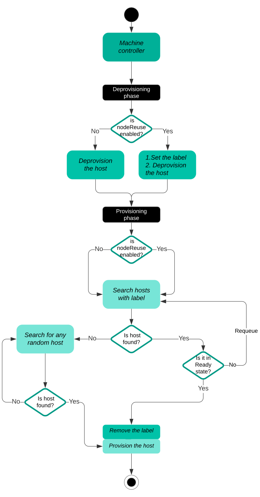

<!--
This work is licensed under a Creative Commons Attribution 3.0
Unported License.

http://creativecommons.org/licenses/by/3.0/legalcode
-->

# node reuse

## Status

implemented

## Summary

Node reuse during the upgrade/remediation operation.

## Motivation

Sometimes it is necessary to make some upgrades to the Metal3 cluster. These
upgrades can happen when updates occur on `Metal3MachineTemplate` object; for
example, user modifies node image version via `spec.template.spec.image.url`
field, or on `KubeadmControlPlane`; for example, a user modifies Kubernetes
version via `spec.version` field. Once update takes place, owning controller
(e.g. KCP controller) starts rolling upgrade. As such, CAPI `Machines`, CAPM3
`Metal3Machines` will be re-created based on the KCP changes. And of course,
`BareMetalHosts` (below will be referenced as host) which are owned by
`Metal3Machines`, will be deprovisioned. Normally, when host is
getting deprovisioned, Ironic cleans up root and externally attached disks on
the host. However, while performing upgrade operation we don't want hosts
external disk data to be cleaned so that when host becomes provisioned
again, it has still the disk data untouched.

### Goals

Add a logic to label, filter and pick those labelled hosts when going through a
re-provisioning cycle as part of the upgrade procedure.

### Non-Goals

Support node reuse for Machines which are created independently of Kubeadm
Control Plane controller/Machine Deployment(KCP/MD). Currently we are not trying
to support node reuse feature for the Machines not owned by higher level objects
like KCP/MD. Because, if there is no KCP/MD that Machine could point to, then
Cluster API Provider Metal3 (CAPM3) Machine controller will fail to first, set
the label in the hosts and second, to filter the hosts based on the label.

## Proposal

We would like to propose an interface to mark hosts that we want to reuse after
deprovisioning and second, add a selection/filtering mechanism in CAPM3 Machine
controller that will select those hosts with a specific label (to be exact, based
on the label `infrastructure.cluster.x-k8s.io/node-reuse`).

To achieve this, we need to

1. be able to disable disk cleaning while deprovisioning.
  This [feature](https://github.com/metal3-io/metal3-docs/blob/main/design/cluster-api-provider-metal3/allow_disabling_node_disk_cleaning.md)
  is implemented.

1. be able reuse the same pool of hosts so that we get the storage
  data back. Currently, there is no mechanism available in Metal³ to pick the
  same pool of hosts that were released while upgrading/remediation - for the
  next provisioning phase. And this proposal tries to solve it.

**NOTE:** This proposal focuses on upgrade use cases but it isn't limited to
only upgrade. Other use cases like remediation can also benefit from this
feature as well.

### User Stories

#### Story 1

As a cluster admin, I would like the re-use the same nodes during the upgrade
operation so that I don't loose secondary storage data attached to them.

#### Story 2

As a cluster admin, I would like the re-use the nodes during the remediation
operation so that I don't loose secondary storage data attached to them.

#### Story 3

As a cluster admin, when nodeReuse is disabled, I want to preserve the current
flow of host selection.

## Design Details

We propose modifying the Metal3MachineTemplate CRD to support enabling/disabling
node reuse feature. Add `nodeReuse` field under the spec of the Metal3MachineTemplate,
that stores boolean type of a value.

When set to True, CAPM3 machine controller tries to reuse the same pool of hosts.

If no value is provided by the user, default value False is set and the current
flow is preserved.

E.g. Metal3MachineTemplate CR

```yaml
apiVersion: infrastructure.cluster.x-k8s.io/v1alpha4
kind: Metal3MachineTemplate
spec:
  nodeReuse: true
  template:
    spec:
      image:
```

During upgrade, to avoid our hosts from being selected for other KCP/MD pools,
`infrastructure.cluster.x-k8s.io/node-reuse` label will be set. The label
stores the name of the KCP/MD that hosts belong to. In the example CR below, MD
named _md-pool1_ is set to the label (_kcp-pool1_ will be set in case the host
belongs to KCP).

E.g. BareMetalHost CR

```yaml
apiVersion: metal3.io/v1alpha1
kind: BareMetalHost
metadata:
  labels:
    infrastructure.cluster.x-k8s.io/node-reuse: md-pool1
```

### Implementation Details/Notes/Constraints

#### Node Reuse Approach

We should perform two steps to re-use the same pool of hosts.

1. During host deprovisioning, set the `infrastructure.cluster.x-k8s.io/node-reuse`
  label;
1. During next provisioning, try to select any host in `Available` state and having
  a matching `infrastructure.cluster.x-k8s.io/node-reuse` label;

The actual implementation will be done within the CAPM3 Machine controller.

Step1 can be done as follows:

- CAPM3 controller sets the `infrastructure.cluster.x-k8s.io/node-reuse: md-pool1`
  label on the hosts belonging to the same KCP/MD.

Step2 can be done as follows:

- CAPM3 controller filters host labelled with
  `infrastructure.cluster.x-k8s.io/node-reuse: md-pool1` label.

  Next:
   - If host is found in `Available` state:
      - Pick that host for newly created M3M;
      - Once it is picked up, remove the whole label
    (`infrastructure.cluster.x-k8s.io/node-reuse: md-pool1`)
    from the host.
   - If host is found in any other state than `Available` state:
      - Requeue until that host becomes `Available`;
   - If no host is found, while it should be (i.e for some reason host
    is not in the cluster anymore):
      - Fall back to the current flow, which selects host randomly.

<!-- markdownlint-disable no-inline-html -->
<p align="center">
    
    <br>
    <em></em>
</p>
<!-- markdownlint-enable no-inline-html -->

**What if there are two parallel KCP/MD experiencing upgrade?**

  Two MachineDeployments(md-pool1 for the MD named pool1 and md-pool2 for the MD
  named pool2) with nodeReuse set to True & False respectively start upgrade at
  the same time. During provisioning, CAPM3 Machine controller tries to find
  hosts with `infrastructure.cluster.x-k8s.io/node-reuse: md-pool1` label for
  md-pool1, and `infrastructure.cluster.x-k8s.io/node-reuse: md-pool2` label for
  md-pool2. Based on the logic on diagram above, for md-pool1, machine controller
  finds hosts with the md-pool1 label and picks them for provisioning. For md-pool2,
  controller searches for hosts with md-pool2 label and fails to find any
  (because label wasn't set during deprovisioning due to disabled NodeReuse). As
  such, controller falls back to select random hosts.

**What if we found N-1 hosts with label, while we expect N hosts?**
  Then we select any other hosts, even though it has no label we expect.

**What if user changes from node reuse to no node reuse in the middle of upgrade?**

  In the middle of the upgrade process, when hosts (already labelled during
  deprovisioning) are provisioning, user disables nodeReuse. Based on the
  diagram above, CAPM3 machine controller always picks labelled hosts (when
  found) regardless of nodeReuse feature is disabled/enabled. The reason is, we
  want to ensure that the controller doesn't miss labelled hosts. In short,
  labelled hosts always take the precedence over unlabelled hosts during selection.

### Risks and Mitigations

None

### Work Items

- add `nodeReuse` field in the spec of the M3MTemplate;

- introduce a label `infrastructure.cluster.x-k8s.io/node-reuse`;

- add filtering logic to select specific hosts.

### Dependencies

None

### Test Plan

- Unit tests should be added in CAPM3.

## Drawbacks

None

## Alternatives

None

## References

- Remediation proposal in Metal3: [Remediation](https://github.com/metal3-io/metal3-docs/blob/c4a981275e6bf7cf8b77a274d7db83089b6edd4a/design/cluster-api-provider-metal3/capm3-remediation-controller-proposal.md)
- Disable disk cleaning proposal in Metal3: [Disable disk cleaning](https://github.com/metal3-io/metal3-docs/blob/main/design/cluster-api-provider-metal3/allow_disabling_node_disk_cleaning.md)
