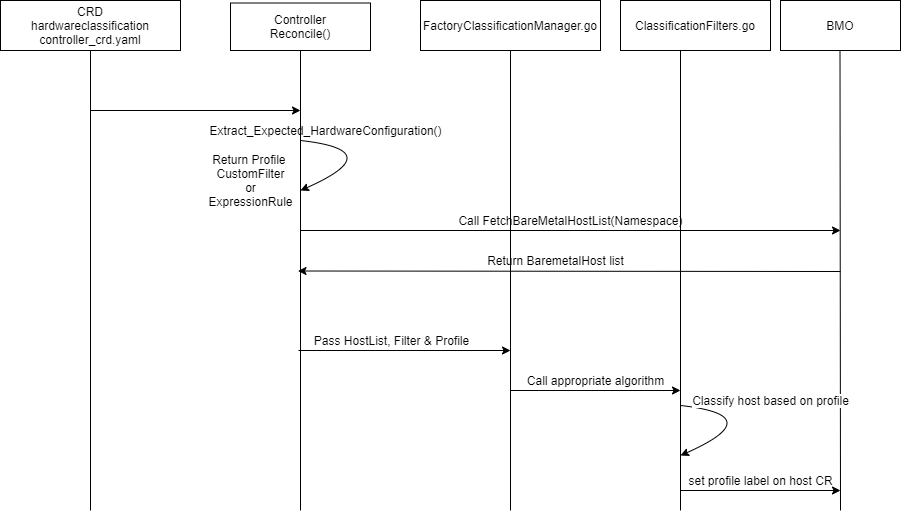

<!--
 This work is licensed under a Creative Commons Attribution 3.0
 Unported License.

 http://creativecommons.org/licenses/by/3.0/legalcode
-->

# Hardware Configuration Validation

## Table of Contents

<!--ts-->
   * [Hardware Configuration Validation](#title)
      * [Table of Contents](#table-of-contents)
      * [Summary](#summary)
      * [Motivation](#motivation)
         * [Goals](#goals)
      * [Proposal](#proposal)
         * [Implementation Details/Notes/Constraints ](#implementation-detailsnotesconstraints-optional)
         * [Risks and Mitigations](#risks-and-mitigations)
      * [Design Details](#design-details)
         * [Work Items](#work-items)
         * [Dependencies](#dependencies)
         * [Test Plan](#test-plan)
      * [References](#references)

## Summary

Code with the ability to perform the comparison on inspected and ready hosts and update the host with labels containing matched profiles.

## Motivation

We need to validate and compare hardware configuration against host hardware details-section.

### Goals

Purpose is to add a new CRD `HardwareClassificationController` to hold the  hardware details that reconciles those by looking for host CRs that matches with hardware classification profile and add label as "BMO-OK" for matched profile into baremetal host baremetalHost_crd.yaml.

## Proposal

We are creating proposal based on the discussion with metal3 community on issue #351:
https://github.com/metal3-io/baremetal-operator/issues/351

We compared introspection data of Ironic with metal3 schema and we found that default  hardware
configuration needs to be added by introducing a new CRD `HardwareClassificationController`.

We will write a CRD that checks inspected baremetal hosts against hardware configuration and add label as "BMO-OK" for matched profile into baremetal host baremetalHost_crd.yaml.
  
### Implementation Details/Notes/Constraints

Link for Existing Metal3 Specs
Please refer metal3 spec for bare-metal:
https://github.com/metal3-io/baremetal-operator/blob/master/deploy/crds/metal3.io_baremetalhosts_crd.yaml

* Write a below schema for new CRD under folder deploy/crds for Kind HardwareClassificationController.

    ```yaml
    - properties:
        expectedHardwareConfiguration:
            default:
            properties:
            customFilter:
                    type: String
            namespace:
                    type: String
            profileName:
                    type: String
            cpu:
                properties:
                    count:
                        type: Integer
            type: Object
            disk:
                properties:
                    rootDisk:
                        sizeBytesGB:
                            type: Integer
                    type: Object
                    dataDisk:
                        sizeBytesGB:
                            type: Integer
                    numberOfDisks:
                        type: Integer
                    type: array
            type: Object
            nics:
                properties:
                    numberOfNICS:
                        type: Integer
            type: Object
            ram:
                properties:
                    sizeBytesGB:
                        type: Integer
            type: Object
            systemVendor:
                properties:
                    productName:
                        type: String
                    manufacturer:
                        type: String
            type: Object
            firmware:
                properties:
                    version:
                        RAID:
                            type: String
                        BasebandManagement:
                            type: String
                        BIOS:
                            type: String
                        IDRAC:
                            type: String
                type: Object
            required:
            - customFilter
            - namespace
            - profileName
        rules:
            properties:
                feild:
                    type: String
                operation:
                    type: String
                value:
                    type: String
        type: object
        required:
        - feild
        - operation
        - value
    ```
* Write a new API as hardware-classification-controller/api/v1alpha1 and new kind(CRD) HardwareClassificationController.
    e.g.
        
       kubebuilder create api --group metal3.io --version v1alpha1 --kind HardwareClassificationController
    
    - This will create the files api/v1alpha1/hardwareClassificationController_types.go where the API is defined and the controller/hardwareClassificationController_controller.go where the reconciliation business logic is implemented for this Kind(CRD).

    - Implement a new function fetchHost() which will fetch all baremetal hosts from Baremetal-Operator of namespace 'metal3' provided by user in CRD_yaml. This function will return a list of filtered hosts(hosts in status 'ready' or 'inspecting'). 

    - In hardwareClassificationController_controller.go, reconcile function will call fetchHost()        function to fetch all baremetal hosts and also extract expectedHardwareConfiguration or expression rules from `metal3.io_HardwareClassificationController_crd.yaml`.

    - Create a classification_manager.go file. If user provieds value for expectedHardwareConfiguration then write a function manager() which will have inputs namespace, customFilter and BMH host_list. This function will call appropriate filter written in classification_filter.go based on 'customFilter' specified by user in CRD_yaml. If user have set different expression rules instead of custom classification filters for filtering BMH then filtering will be done based on 'operation' value provided.

    - The ClassificationFilters.go file will contain multiple comparision algorithms based on multiple custom classification filters(i.e minimum and maximum) or expression filters. Create a FactoryClassificationManager() function which will have inputs baremetalhost list and extracted hardware profile. FactoryClassificationManager's job is to call respective filtering algorithm and parse the inputs accordingly so respective filtering algorithm will check each host against profile and update the label like below if match found. 

        ```yaml
        "metadata": {
            "labels": {
                "profile.metal3.io/profile1" : "BMO-OK",
                "profile.metal3.io/profile2" : "BMO-OK"
            }
        }
        ```


* Create the Schema struct for `ExpectedHardwareConfiguration` inside `HardwareClassificationControllerSpec`,
in file /api/v1alpha1/hardwareClassificationController_types.go.

    ```yaml
    type ExpectedHardwareConfiguration struct {
        CustomFilter  string        `json:"customFilter"`
        ProfileName   string        `json:"profileName"`
        Namespace     string        `json:"namespace"`
        Cpu           Cpu           `json:"CPU"`
        Disk          Disk          `json:"Disk"`
        Nics          Nics          `json:"NICS"`
        Ram           int64         `json:"RAM"`
        SystemVendor  SystemVendor  `json:"systemVendor"`
        Firmware      Firmware      `json:"firmware"`
    }
    
    type Cpu struct {
        Count  int      `json:"count"`
    }
    
    type Disk struct {
        RootDisk       RootDisk    `json:"rootDisk"`
        DataDisk       DataDisk    `json:"dataDisk"`
    }

    type RootDisk struct {
        SizeBytesGB    int64      `json:"size"`
    }

    type DataDisk struct {
        SizeBytesGB    int64     `json:"size"`
        NumberOfDisks  int       `json:"numberOfDisks"`
    }
    
    type Nics struct {
        NumberOfNics   int      `json:"numberOfNics"`
    }
    
    type SystemVendor struct {
        ProductName     string  `json:"productName"`
        Manufacturer    string  `json:"manufacturer"`
    }

    type Firmware struct {
        Version Version `json:"version"`
    }

    type Version struct {
        RAID               string `json:"RAID"`
        BasebandManagement string `json:"baseBandManagement"`
        BIOS               string `json:"BIOS"`
        IDRAC              string `json:"IDRAC"`
    }

    type Rules struct {
        Feild       string  `json:"feild"`
        Operation   string  `json:"operation"`
        Value       string  `json:"value"`
    }
    ```

### Risks and Mitigations

None

## Design Details

The following diagram shows the implementation details of Hardware Classification Controller.




### Work Items

1. Implement CRD for `HardwareClassificationController`.
2. Create the Schema struct for HardwareConfiguration and Rules inside HardwareClassificationControllerSpec, in file pkg/api/metal3/v1alpha1 hardwareClassificationController_types.go
3. Fetch baremetal host list from the baremetal operator running in the metal3 cluster.
4. Extract the expectedHardwareConfiguration or rules from HCC profile CR applied to the CRD. If customeFilter and expression rules both are given then user will get an error that one Of the two can be
passed.
5. Create a FactoryClassificationManager.go file. Write a function FactoryClassificationManager() to call appropriate filter algorithm written in ClassificationFilters.go.
6. Create a ClassificationFilters.go file. Write multiple algorithms based on the custom filter or expression filter to classify host against profile or rules.
7. Set labels for baremetal host CR if it matches the profile.
8. Write unit tests for above implementation.

### Dependencies

- Ironic

- Cluster-Api-Baremetal-Provider

- Baremetal-Operator

### Test Plan
 
- Unit tests will be implemented.

- Functional testing will be performed with respect to implemented HardwareClassificationController CRD and controller.

- Deployment & integration testing will be done.

## References

* https://github.com/metal3-io
* https://github.com/metal3-io/hardware-classification-controller

