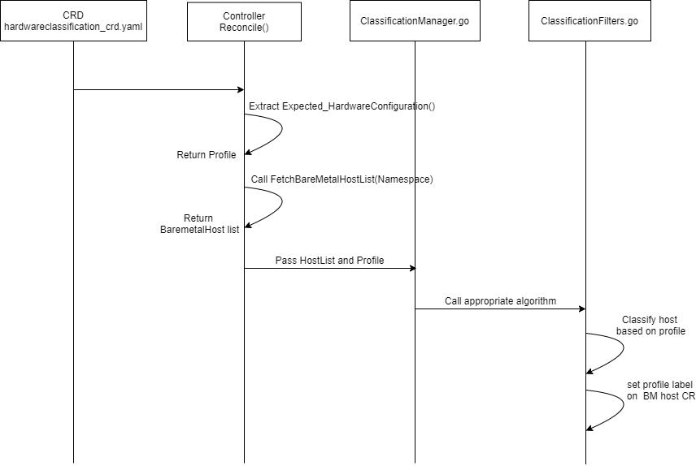

<!--
 This work is licensed under a Creative Commons Attribution 3.0
 Unported License.

 http://creativecommons.org/licenses/by/3.0/legalcode
-->

# Hardware Classification Controller

## Summary

Code with the ability to perform the comparison on inspected and ready
hosts and update the host with labels containing matched profiles.

## Motivation

We are closely working with Airship team, There is one requirement in
Airship for classification.  As an User, I want to validate and
classify the hosts based on my hardware requirement so that I will get
to know how many hosts match to my profile and accordingly I can go
ahead and provision these hosts only.  This feature helps user to
avoid runtime failures and also increases the performances for
workload deployments.

### Goals

Automatically classify bare metal hosts based on user-provided rules
in a way that other controllers can use, without having to evaluate
all of those rules themselves.

## Proposal

We are creating proposal based on the discussion with metal3 community
on [issue #351](https://github.com/metal3-io/baremetal-operator/issues/351).

We compared introspection data of Ironic with metal3 schema and we
found that default hardware configuration needs to be added by
introducing a new CRD `HardwareClassification`.

We will write a CRD that checks inspected baremetal hosts against
hardware configuration and add label as "MATCHES" for matched profile
into baremetal host.

### Implementation Details/Notes/Constraints

Please refer to the [metal3 spec for
bare-metal](https://github.com/metal3-io/baremetal-operator/blob/93cd6bdae72ff44a3b68cea7d549abd758d27838/config/crd/bases/metal3.io_baremetalhosts.yaml).

- Below is sample yaml of Kind HardwareClassification.

```yaml
apiVersion: metal3.io.sigs.k8s.io/v1alpha1
kind: HardwareClassification
metadata:
  name: profile1
spec:
expectedValidationConfiguration:
  namespace: metal3
  CPU:
  minimumCount: 4
  minimumSpeed: 4.3
  Disk:
    minimumCount: 2
    minimumIndividualSizeGB: 2200
  NIC:
    minimumCount: 4
  RAM:
    minimumSizeGB: 32
```

   Similarly, user can mention maximum requirements for CPU, Disk, NICS and RAM.

- Write a new API as hardware-classification/api/v1alpha1 and new
  kind(CRD) HardwareClassification.

   - Create the Schema struct for `ExpectedHardwareConfiguration`
    inside `HardwareClassificationSpec`, in file
    /api/v1alpha1/hardwareClassification_types.go.

   - Implement a new function fetchHost() which will fetch all
    baremetal hosts from Baremetal-Operator of provided namespace by
    user in CRD_yaml. We will add a watch on the baremetalhost kind
    for the hardware setting changes.

   - Create a classification_manager.go file. Create a function which
    will call appropriate filter written in classification_filter.go
    based on minimum or maximum requirements specified by user in
    CRD_yaml.

   - The ClassificationFilters.go file will contain implementation of
    classification algorithms based on requirements given by user (i.e
    minimum or maximum). Classification will be done for minimum >=
    and for maximum <= against hosts.

   - Once the classification is completed, will add label if user has
    provided any, otherwise it will be added as
    `hardwareclassification.metal3.io/<profile-name>: matches`.

### Risks and Mitigations

None

## Design Details

The following diagram shows the implementation details of Hardware
Classification Controller.



### Work Items

1. Implement CRD for `HardwareClassification`.
1. Create the Schema struct for HardwareConfiguration inside
   HardwareClassificationSpec, in file pkg/api/metal3/v1alpha1
   hardwareClassification_types.go
1. Add a watch on kind BareMetalHost to get updated baremetal host
   lists.
1. Fetch baremetal host list from the baremetal operator running in
   the metal3 cluster.
1. Extract the expectedHardwareConfiguration from HCC profile CR
   applied to the CRD.
1. Create a FactoryClassificationManager.go file. Write a function to
   call appropriate filter algorithm written in
   ClassificationFilters.go.
1. Create a ClassificationFilters.go file. Write comparison
   algorithms based on minimum or maximum requirements given by user
   to classify host.
1. Set labels for baremetal host CR.
1. Write unit tests for above implementation.

### Dependencies

- Ironic

- Cluster-Api-Baremetal-Provider

- Baremetal-Operator

### Test Plan

- Unit tests will be implemented.

- Functional testing will be performed with respect to implemented
  HardwareClassification CRD and controller.

- Deployment & integration testing will be done.

## References

- <https://github.com/metal3-io/hardware-classification-controller>
