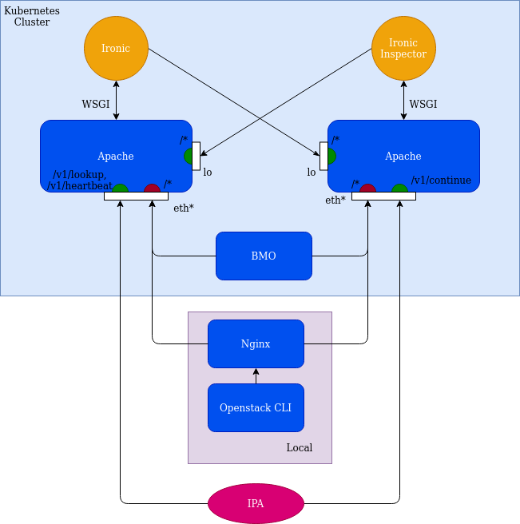

<!--
 This work is licensed under a Creative Commons Attribution 3.0
 Unported License.

 http://creativecommons.org/licenses/by/3.0/legalcode
-->

# Ironic authentication

## Status

provisional

## Summary

Currently, Ironic and Ironic inspector APIs are unauthenticated to allow BMO to
interact directly and without authentication with Ironic. However this opens a
very wide attack target as anything running on a node that has an IP address on
the provisioning network is able to access both APIs and hence control Ironic.
This proposal modifies the ironic setup and BMO implementation to set up an
authentication mechanism. This proposal covers a simple username/password
authentication, a mutual TLS authentication setup and a keystone based
authentication. In addition, it enables HTTPS for most of the APIs.

Some calls between ironic and ironic inspector or between IPA and ironic or
ironic inspector do not support some of the targeted authentication mechanisms.
For those calls, a solution is proposed, through the loopback interface or a
dedicated https endpoint, while IPA would accept insecure calls to ironic and
inspector (HTTPS with possibly self-signed certificates on the ironic side).

## Motivation

This proposal attempts to solve the ironic authentication
[issue](https://github.com/metal3-io/metal3-docs/issues/92). Ironic APIs are
unauthenticated and this is a security issue, especially considering the
pivoting scenarios. In order to secure the setup, we want to place the ironic
APIs behind authentication and encryption as much as possible to not let
passwords travel in clear. The end goal would be to use either Keystone or a
mutual TLS authentication between BMO and ironic or inspector.
Since ironic and inspector do not support all of those directly, an
intermediary proxy might be used to take care of the encryption and
authentication in some cases. The direct communications from ironic or
inspector to each other might remain unauthenticated and unencrypted,
similarly as from IPA that supports only HTTPS, without mTLS, when the image is
not custom built.

### Goals

* Require authentication to use the ironic or inspector API
* Allow traffic from IPA unauthenticated and unencrypted
* Allow traffic between ironic and inspector unauthenticated and unencrypted
* Implement an alternative script to run openstack CLI without modifying the CLI
  itself
* Modify BMO to support encryption and authentication

### Non-Goals

* Implement authentication within ironic, inspector or IPA
* Modify the CLI to support the added authentication
* Build a special IPA with the correct certs for mTLS embedded as the image can
  be downloaded without authentication and it would be straightforward to extract
  a certificate

## Proposal

### User Stories

#### Story 1

As a developer I want the traffic between BMO and ironic to be encrypted and
authenticated. As such, I want Ironic to refuse all traffic that is
unauthenticated, except for the internal and IPA traffic

#### Story 2

As a user I want to be able to run containers on cluster members without
trusting them not to access the Ironic/Inspector APIs. I want them not to be
able to access the APIs by default.

#### Story 3

As a user I want to be able to keep using Openstack CLI for debugging.

## Design Details

No changes would be made on the CRDs. All changes would be related to the
ironic setup and the adaptation of BMO to be able to use the authentication
mechanism.

The core change would be to run Ironic and Inspector API services behind a
reverse proxy, using WSGI, for example apache with mod-wsgi. This would allow
offloading the encryption to Apache, in addition to the possible
authentication (not in Keystone case). The certificates would be generated and
managed by cert-manager. BMO would use a custom HTTP client in
[gophercloud](https://github.com/gophercloud/gophercloud/blob/master/docs/FAQ.md#implementing-default-logging-and-re-authentication-attempts)
to accept that certificate. The certificate could either be self-signed or
created using a CA given by the user. In addition, if using mTLS, a second
certificate would be created for the BMO client from the same CA and validated
by Apache.

Considering that Ironic and Inspector are deployed in the same pod, using host
networking, they can communicate over the loopback interface, using http or
https. IPA can communicate with ironic and inspector over https (using
ipa-insecure parameter to support self-signed certificates). However, it cannot
authenticate itself using certificates if they are not built in the image. This
process being too complex for the benefit (IPA already uses a token mechanism
for authentication), the endpoints used by IPA will not require a client
certificate (/v1/lookup and /v1/heartbeat for ironic, and /v1/continue for
inspector). They will however be served with HTTPS. In addition, / and /v1/ will
not require authentication.

### Implementation Details/Notes/Constraints

#### HTTPS Setup

In order to simplify the HTTPS setup, when deployed in a Kubernetes cluster,
cert-manager would be used to manage the certificates and CA. A first
self-signed issuer would be created to generate a CA certificate. This CA
certificate would be used to create a second issuer. This second issuer would
be used to generate the server certificates (ironic and inspector), and the
client certificates (BMO and CLI).

A naming convention would allow the use of the same CA for the certificate for
BMO (deployed as part of CAPM3 for example, or on its own), and for the
certificate for the Ironic pod containers.

In order to share the CA, there is two alternatives :

* BMO and ironic are deployed in the same namespace, they can then share the
  same issuer. However, this adds a requirement for the deployments to share
  the same namespace
* BMO and Ironic are deployed in different namespaces. In this case they must
  share a clusterIssuer. This would work across namespaces, however, a
  certificate could be requested from any other namespace, as long as the user
  creating it has the proper RBAC rights to create a Certificate object. This
  means that it would be very straightforward to get a certificate and
  authenticate as an ironic client. This solution should not be considered.

In order to use a properly secured setup with HTTPS, BMO and ironic should be
deployed in the same namespace, using the same CA, created by cert-manager.

It should be ensured that a rotation of the certificates or of the CA would be
effective immediately for all pieces of the setup.

#### Mutual TLS

This option is more secure than basic authentication. The CA and the
certificates would be managed by cert-manager. Cert-manager would create the
self-signed CA if not provided by the user, a certificate for the server, and
a certificate for the clients (BMO and CLI). The secrets and CA would be
stored in secrets and mounted in the ironic and inspector containers and in
the BMO container. BMO would use the certificates to authenticate towards the
web server running the wsgi applications. The JSON RPC interface of Ironic
would also be protected by mTLS.

All internal traffic from Ironic to Inspector and vice-versa would go
unencrypted over the loopback interface

In order to keep the openstack CLI tool working, if no direct support for mTLS
has been added or during the development process, the script running it
currently in metal3-dev-env would be modified to :

* Fetch the client certificate from the cluster
* Start a reverse proxy locally (in a container) that uses the client
  certificate to connect to inspector and ironic
* Configure clouds.yaml to connect without authentication to the local reverse
  proxy
* Start the current openstack cli container with the command arguments, that
  will then connect to the local reverse proxy that will authenticate towards
  the ironic and inspector web servers.

The setup would look like the following (red is authenticated, green is unauthenticated)

#### Impact on pivoting

In order to perform the pivoting, a second instance of CAPM3 and BMO is started
on the target cluster. A second instance of ironic cannot however be started
until the first instance is removed, to not duplicate the DHCP. Since ironic is
using keepalived to share the IP address, this means that the second BMO
instance, deployed with a new secret, will try to communicate with the first
ironic instance and fail, since the CA that signed the first ironic instance
certificate is unknown to the second BMO instance. There would also be a client
certificate mismatch in addition to the server certificate mismatch. This would
be resolved when the first ironic instance is removed and the second ironic
instance deployed, finalizing the pivoting.

It is possible to overcome the issue by using a CA provided by the user.

### Risks and Mitigations

A Keystone based solution is too complex for the added benefits (considering
that BMO is mostly the only client of Ironic and inspector), while the basic
authentication might not be sufficiently secured for some of our stakeholders.

Adding a web server with a wsgi solution also increases the complexity of the
setup. However, it is proven to be a successful production setup in multiple
ironic setups.

Using mTLS adds a high level of complexity to use any other clients than BMO.
For example to use the Openstack CLI we would need a solution such as a local
reverse proxy taking care of the authentication. However, the CLI is only used
for debugging scenarios in development environments, hence having a lower
impact.

Running BMO locally would then require having a local copy of the client
certificate, or having an unencrypted and unauthenticated setup option. An
insecure environment can be kept for development purposes.

### Work Items

This is to implement the mTLS solution.

* Create certificates properly with cert-manager (also for client if mTLS)
* Run Ironic and inspector using a web server and a wsgi solution
* Configure the web server to use those certificates, and offer unencrypted
  endpoints on the loopback interface.
* Modify BMO to accept the server certificate (and authenticate with the
  client certificate if mTLS), using the certificates form the secrets
* Modify the Openstack CLI script to run a local proxy if needed and
  authenticate.

### Dependencies

None

### Test Plan

The secure setup will be deployed and tested as part of the metal3-dev-env
integration tests ran for all PRs and daily from main.

### Upgrade / Downgrade Strategy

The upgrade will be achieved by deploying the new ironic deployment (inc.
pods, certificates etc.) and deploying the new BMO deployment (possibly as
part of CAPM3), with the upgraded version of BMO.

### Version Skew Strategy

BMO would be able to use authentication when needed by a configuration change
of the environment variable, so that it supports unauthenticated calls to
ironic.

## Drawbacks

The drawbacks are discussed for each option. Overall, this adds more complexity
in the ironic setup.

## Alternatives

### Basic authentication

Ironic supports basic authentication. Ironic can also run with an HTTPS
endpoint. However, offloading the encryption to a reverse proxy could help with
regards to performances and encryption support. The reverse proxy could also
take care of the authentication temporarily, or pass the headers to Ironic and
Inspector. If not using Ironic's built-in basic authentication, the endpoints
used by IPA must remain free of authentication.

The content of the `htpasswd` file would need to be based on a shared secret
between ironic, BMO and the CLI client. Any updates to the secret should update
the `htpasswd` file and the clients to avoid breaking the authentication.

The openstack CLI would also need to support basic authentication, if it is not
the case, using a reverse proxy to set the headers properly would be a
possibility.

#### Impact of basic authentication on pivoting

The second BMO instance, deployed with a new secret, will not be able to
communicate with the first ironic instance during the pivoting step. In
addition, the server certificate of the first ironic instance would not be
recognized by the second BMO instance. This would be resolved when the first
ironic instance is removed and the second ironic instance deployed, finalizing
the pivoting.

It would be possible to overcome those two problems if using a CA and a
password provided by the user.

### Keystone

A keystone based solution is easier to setup as it is the default supported
authentication mechanism in Openstack. However, the architecture is more
complex due to the required dependencies to run Keystone. It also adds a
required user management to the problem, with a master password to do the
user management on Keystone. The users could be created at start time, using
a shared secret for password for example. However, the rotation of such
passwords is not as straightforward as the rotation of the certificates. This
solution would not require any additional web server or proxy, but would
require a secured keystone.

This solution is considered as heavy and complicated with regards to the goal
of running a standalone secure Ironic.

#### Impact of Keystone on pivoting

The impact is similar to the two previous solutions since the second BMO
instance would authenticate with the first Keystone instance using a password
generated for the second instance that would not match the first instance
password.

It would be possible to overcome those two problems if using a CA and a
password provided by the user.

### Using loopback interface only

If BMO runs as part of the ironic pod, then it can interact with ironic via
the loopback interface without authentication. However, some endpoints need to
be exposed to IPA. This can be achieved with a reverse proxy.

This solution would go against the effort that was made to decouple BMO and
ironic, and would not integrate properly with clusterctl. BMO would be tied to
ironic. In addition it would not be possible to use the openstack CLI from
outside the host where ironic runs. This means that the command line would
probably have to be run as a container on the same host.

#### Impact of loopback connectivity on pivoting

This solution goes against the pivoting functionality as BMO would be deployed
as part of Ironic and not CAPM3. This means that when doing the clusterctl
pivoting, the BMH would need to be handled separately. If ironic keeps running
on the initial cluster, BMO cannot be started on the second cluster, until
ironic is set up on the target cluster.

## References

* [ironic issue](https://github.com/metal3-io/metal3-docs/issues/92)
* [Ironic and WSGI](https://docs.openstack.org/ironic/pike/install/include/configure-ironic-api-mod_wsgi.html)
