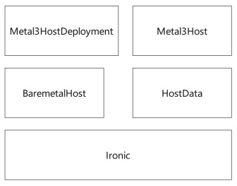
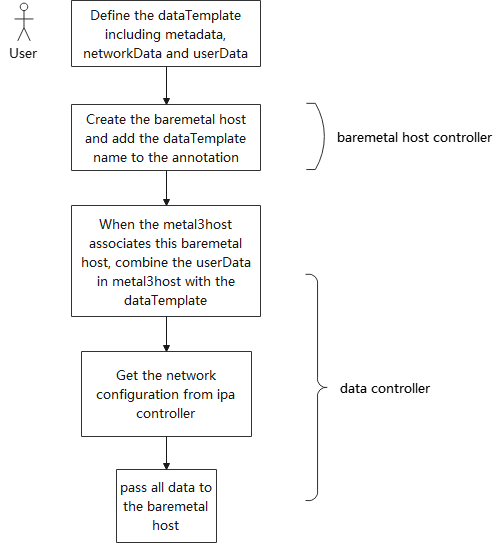
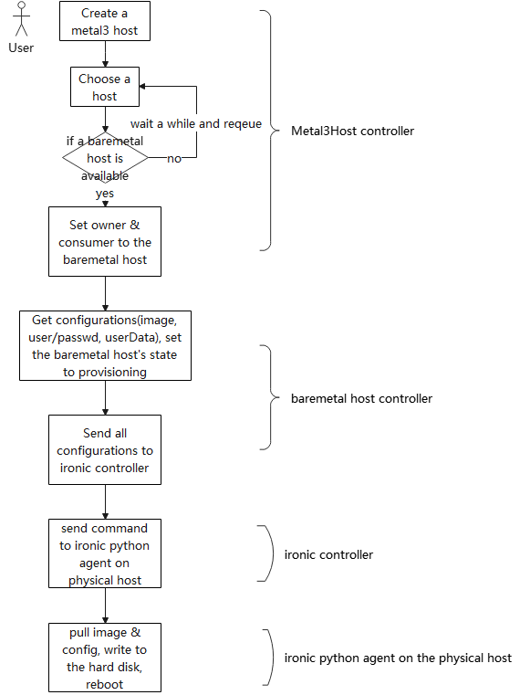
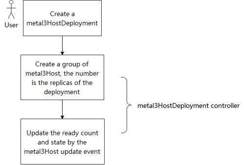

# Baremetal host single instance and multi-instance operator
## Introduction
Currently, the metal3 system is to set up a Kubernetes cluster on bare-metal hosts which is tightly bound with cluster-api and Kubernetes. We target to allocate bare-metal hosts that just pre-installing the OS, or pre-installing the applications as required.
## Motivation 
To meet the scenery that only requires a pure bare-metal host or with a simple application installed.
## Goals
- Allocate one pure bare-metal host 
- Allocate multiple bare-metal hosts
- Allocate bare-metal host with pre-installed applications
- Specify the different configurations for different bare-metal host 
## Non-goals
- Allocate different types of bare-metal hosts at one time
## Proposal
### Architecture
The operators include the metal3Host operator, metal3HostDeployment operator, and data operator.

The bare-metal host controller and the ironic are not newly developed.

Metal3Host is a virtual instance. Users could define it to require a bare-metal host. In the definition, the user could specify the image to install, could set the selector to choose a specific bare-metal host, and could define the boot data to automatically start their own applications.

Metal3HostDeployment will define a group of metal3Hosts with the same configuration. It could define the number of replicas. It could scale up/down. We even could auto-scale by some rules after the monitor function is leveraged.

The data operator will set up the boot time configuration & routine. It includes three parts: the userData, the metaData, and the networkData. The userData includes some user-specified data such as installing a package, or running a command like "mkdir /test". The metaData defines some host-specific data such as hostname. The networkData includes the network configuration. The data is bound with the baremetal host. For example, the networkData defines a NIC with an IP, the NIC name is host related. So a dataTemplate should be pre-defined, it will be bound to the bare-metal host when a metal3host is defined and associated with a bare-metal host.
### Routine
#### Pre-define a dataTemplate

#### Require a metal3host

#### Require a metal3HostDeployment

### Configuration
#### metal3host

    // Metal3HostSpec defines the desired state of Metal3Host
    type Metal3HostSpec struct {
        // ProviderID will be the  Metal3Host in ProviderID format
        // (://<bmh-uuid>)
        // +optional
        ProviderID *string `json:"providerID,omitempty"`

        ConsumerRef *corev1.ObjectReference `json:"consumerRef,omitempty"`

        // UserScript is specified by user and it will run on every boot.
        BootScript string `json:"bootScript,omitempty"`

        // User is the configuration used to initialize user in guest os.
        // Default user is `root`.
        User User `json:"user,omitempty"`

        // Image is the image to be provisioned.
        Image Image `json:"image,omitempty"`

        // HostSelector specifies matching criteria for labels on BareMetalHosts.
        // This is used to limit the set of BareMetalHost objects considered for
        // claiming for a Metal3Host.
        // +optional
        HostSelector HostSelector `json:"hostSelector,omitempty"`

        // When set to disabled, automated cleaning of host disks will be skipped
        // during provisioning and deprovisioning.
        // +kubebuilder:validation:Enum:=metadata;disabled
        // +optional
        AutomatedCleaningMode *string `json:"automatedCleaningMode,omitempty"`
    }

#### metal3hostDeployment
	// Metal3HostDeploymentSpec defines the desired state of Metal3HostDeployment.
	type Metal3HostDeploymentSpec struct {
		// Number of desired machines. Defaults to 1.
		// This is a pointer to distinguish between explicit zero and not specified.
		// +optional
		// +kubebuilder:default=1
		Replicas *int32 `json:"replicas,omitempty"`

		// HostSelector specifies matching criteria for labels on BareMetalHosts.
		// This is used to limit the set of BareMetalHost objects considered for
		// claiming for a machine.
		// +optional
		HostSelector HostSelector `json:"hostSelector,omitempty"`

		// Template describes the metal3 hosts that will be created.
		Template Metal3HostTemplateSpec `json:"template"`

		// Minimum number of seconds for which a newly created machine should
		// be ready.
		// Defaults to 0 (machine will be considered available as soon as it
		// is ready)
		// +optional
		MinReadySeconds *int32 `json:"minReadySeconds,omitempty"`

		// The number of old MachineSets to retain to allow rollback.
		// This is a pointer to distinguish between explicit zero and not specified.
		// Defaults to 1.
		// +optional
		RevisionHistoryLimit *int32 `json:"revisionHistoryLimit,omitempty"`

		// Indicates that the deployment is paused.
		// +optional
		Paused bool `json:"paused,omitempty"`

		// The maximum time in seconds for a deployment to make progress before it
		// is considered to be failed. The deployment controller will continue to
		// process failed deployments and a condition with a ProgressDeadlineExceeded
		// reason will be surfaced in the deployment status. Note that progress will
		// not be estimated during the time a deployment is paused. Defaults to 600s.
		// +optional
		ProgressDeadlineSeconds *int32 `json:"progressDeadlineSeconds,omitempty"`
	}

	// Metal3HostDeploymentStatus defines the observed state of Metal3HostDeployment.
	type Metal3HostDeploymentStatus struct {
		// The generation observed by the deployment controller.
		// +optional
		ObservedGeneration int64 `json:"observedGeneration,omitempty"`

		// Total number of non-terminated machines targeted by this deployment
		// (their labels match the selector).
		// +optional
		Replicas int32 `json:"replicas"`

		// Total number of non-terminated machines targeted by this deployment
		// that have the desired template spec.
		// +optional
		UpdatedReplicas int32 `json:"updatedReplicas"`

		// Total number of ready machines targeted by this deployment.
		// +optional
		ReadyReplicas int32 `json:"readyReplicas"`

		// Total number of available machines (ready for at least minReadySeconds)
		// targeted by this deployment.
		// +optional
		AvailableReplicas int32 `json:"availableReplicas"`

		// Total number of unavailable machines targeted by this deployment.
		// This is the total number of machines that are still required for
		// the deployment to have 100% available capacity. They may either
		// be machines that are running but not yet available or machines
		// that still have not been created.
		// +optional
		UnavailableReplicas int32 `json:"unavailableReplicas"`

		// Phase represents the current phase of a Metal3HostDeployment (ScalingUp, ScalingDown, Running, Failed, or Unknown).
		// +optional
		Phase string `json:"phase,omitempty"`

		// FailureReason indicates that there is a fatal problem reconciling the
		// state, and will be set to a descriptive error message.
		// +optional
		FailureReason *string `json:"failureReason,omitempty"`

		Conditions capi.Conditions `json:"conditions,omitempty"`
	}

#### datatemplate
	// DataTemplateSpec defines the desired state of DataTemplate
	type DataTemplateSpec struct {
		//MetaData contains the information needed to generate the metadata secret
		// +optional
		MetaData *MetaData `json:"metaData,omitempty"`

		//NetworkData contains the information needed to generate the networkdata
		// secret
		// +optional
		NetworkData *NetworkData `json:"networkData,omitempty"`

		//UserData contains the information defined by user
		// secret
		// +optional
		UserData *UserData `json:"userData,omitempty"`
	}

	// NetworkData represents a networkData object
	type NetworkData struct {
		// Links is a structure containing lists of different types objects
		// +optional
		Links NetworkDataLink `json:"links,omitempty"`

		//Networks  is a structure containing lists of different types objects
		// +optional
		Networks NetworkDataNetwork `json:"networks,omitempty"`

		//Services  is a structure containing lists of different types objects
		// +optional
		Services NetworkDataService `json:"services,omitempty"`
	}

	// UserData contains the information defined by user
	type UserData struct {
		//Users define the user&password information
		// +optional
		Users []User `json:"users"`

		//WriteFile files to be created at the boot time
		// +optional
		WriteFiles []WriteFile `json:"write_files"`

		//BootCmd commands to be run at the boot time
		// +optional
		BootCmd []string `json:"bootcmd"`
	}

	// MetaData represents a keyand value of the metadata
	type MetaData struct {
		// Strings is the list of metadata items to be rendered from strings
		// +optional
		Strings []MetaDataString `json:"strings,omitempty"`

		// ObjectNames is the list of metadata items to be rendered from the name
		// of objects.
		// +optional
		ObjectNames []MetaDataObjectName `json:"objectNames,omitempty"`

		// Indexes is the list of metadata items to be rendered from the index of the
		// CUMetalData
		// +optional
		Indexes []MetaDataIndex `json:"indexes,omitempty"`

		// Namespaces is the list of metadata items to be rendered from the namespace
		// +optional
		Namespaces []MetaDataNamespace `json:"namespaces,omitempty"`

		// IPAddressesFromPool is the list of metadata items to be rendered as ip addresses.
		// +optional
		IPAddressesFromPool []FromPool `json:"ipAddressesFromIPPool,omitempty"`

		// PrefixesFromPool is the list of metadata items to be rendered as network prefixes.
		// +optional
		PrefixesFromPool []FromPool `json:"prefixesFromIPPool,omitempty"`

		// GatewaysFromPool is the list of metadata items to be rendered as gateway addresses.
		// +optional
		GatewaysFromPool []FromPool `json:"gatewaysFromIPPool,omitempty"`

		// DNSServersFromPool is the list of metadata items to be rendered as dns servers.
		// +optional
		DNSServersFromPool []FromPool `json:"dnsServersFromIPPool,omitempty"`

		// FromHostInterfaces is the list of metadata items to be rendered as MAC
		// addresses of the host interfaces.
		// +optional
		FromHostInterfaces []MetaDataHostInterface `json:"fromHostInterfaces,omitempty"`

		// FromLabels is the list of metadata items to be fetched from object labels
		// +optional
		FromLabels []MetaDataFromLabel `json:"fromLabels,omitempty"`

		// FromAnnotations is the list of metadata items to be fetched from object
		// Annotations
		// +optional
		FromAnnotations []MetaDataFromAnnotation `json:"fromAnnotations,omitempty"`
	}

#### data
	// DataSpec defines the desired state of Data
	type DataSpec struct {
		// DataTemplate is the CUMetalDataTemplate this was generated from.
		Template corev1.ObjectReference `json:"template"`

		// MetaData points to the rendered MetaData secret.
		// +optional
		MetaData *corev1.SecretReference `json:"metaData,omitempty"`

		// NetworkData points to the rendered NetworkData secret.
		// +optional
		NetworkData *corev1.SecretReference `json:"networkData,omitempty"`

		// NetworkData points to the rendered UserData secret.
		// +optional
		UserData *corev1.SecretReference `json:"userData,omitempty"`
	}

	// DataStatus defines the observed state of Data
	type DataStatus struct {
		// Ready is a flag set to True if the secrets were rendered properly
		// +optional
		Ready bool `json:"ready"`

		// ErrorMessage contains the error message
		// +optional
		ErrorMessage *string `json:"errorMessage,omitempty"`
	}
