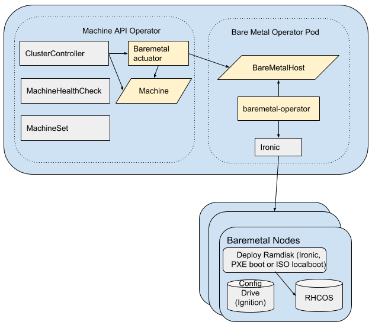

<!--
 This work is licensed under a Creative Commons Attribution 3.0
 Unported License.

 http://creativecommons.org/licenses/by/3.0/legalcode
-->

# nodes-machines-and-hosts

## Status

implemented

## Summary

This document explains the use of Node, Machine, and BareMetalHost
objects to represent different facets of implementing a self-hosted
and Kubernetes-native hardware provisioning system. It explains the
role of each, and why we are using 3 separate resources.

## Motivation

This document details the original design decisions made when the
Metal³ project was launched, and places the information in context
as an aid to future contributors.

### Goals

- Explain Node, Machine, and BareMetalHost and how they relate to
  Metal³
- Encourage input on that design, to refine it.

### Non-Goals

- Discussion of user interface designs related to the resources.

## Proposal

The Metal³ project is building a hardware provisioning system with
a Kubernetes-native API. It includes a provider implementation that
fits into the API defined by the cluster-api SIG. It differs from
other similar implementations by being self-hosted. Where the AWS or
OpenStack providers run within Kubernetes, they allocate resources
from a pool *outside* of the Kubernetes cluster by talking to an API
that is also *outside* of the cluster. Metal³ will run within the
cluster and present a Kubernetes API for tracking available resources.

### Implementation Details/Notes/Constraints

#### Data Model

[Node](https://kubernetes.io/docs/concepts/architecture/nodes/)
objects represent a running instance of kubelet. Their status fields
include basic information about the health of the environment in which
kubelet is running. A user manipulates the Node to change the cluster,
such as draining the node for maintenance. The definition of Node is
owned by the Kubernetes core, and offers few opportunities to attach
custom data.

[Machine](https://kubernetes-sigs.github.io/cluster-api/common_code/machine_controller.html)
objects represent a *request* for an instance of kubelet. A parallel
design is the persistent volume claim and persistent volume in the
storage APIs. The Machine CRD is owned by the cluster-api SIG. Machine
objects are managed by the cluster-api controller using an *actuator*
which works as a plugin driver for the controller. Machine objects
include a "provider spec" field to allow the actuator to store custom
data. The lifecycle of a Machine is based on the desired size of the
cluster. That is, a Machine object does not typically exist in the
database when it does not represent a request to expand the cluster
(see caveats below in the [Alternatives](#alternatives)
section.

`BareMetalHost` objects represent a physical computer, including its
hardware inventory and information to access the onboard management
controller. The BareMetalHost (or "host") CRD is defined in the
[baremetal-operator](https://github.com/metal3-io/baremetal-operator/)
from the Metal³ project. The CRD is made up of completely custom
data, needed to fully realize a Kubernetes-native API for a
self-hosted baremetal provisioning tool. The lifecycle of a host is
based on the availability of hardware, rather than its use as part of
the cluster.

#### Growing the Cluster

The admin user interacts with Metal³ by first registering hosts to
be part of the inventory available to the provisioning
system. Registration can be a manual process, in which the user uses
the UI or API to define a new BareMetalHost object, providing the
information needed to access the host's management
controller. Eventually registration may be partially automated by
having the system create a skeleton host object when it receives a PXE
request from an unknown MAC address.

After registration, each host is matched against known hardware
profiles (comparing information such as NICs, storage, CPUs, RAM,
etc.). Hosts with management controller credentials and that match
known profiles are marked as being ready to be used. The admin (or
autoscaler) can then create a new Machine object as a request to grow
the cluster, either by creating the Machine directly or by
incrementing the replica count on a MachineSet.

The actuator in the
[cluster-api-provider-baremetal](https://github.com/metal3-io/cluster-api-provider-baremetal)
repository will match the hardware profile in the provider spec of the
Machine object to available hosts with the same profile. When an
available host is found, the actuator links it to the Machine, and
adds information to the host to tell the baremetal-operator which
image to provision to it, which machine configuration to use,
etc. After the host is provisioned and rebooted, kubelet connects to
the cluster in the usual way, triggering the creation of a Node
object.

#### Shrinking the Cluster

The admin user (or autoscaler) can similarly delete the Machine
object, breaking the link to the host. When that happens the host is
completely evacuated (going through the standard Kubernetes drain
procedure, as well as removing any storage replicas it contains). The
host is then powered off and placed back into the available inventory
pool.

To completely remove a host, the BareMetalHost object is
deleted. Whether this wipes the storage in the host is yet to be
determined.

### Risks and Mitigations

We risk some confusion by introducing a third entity tied to the
"computer" that is part of the cluster. For other providers, the
information we are storing in the host record would be stored in some
external database (typically behind a cloud API). There will be a few
new operations that admin users will perform on hosts that are not
typically performed on compute resources managed by other providers;
powering a host off to perform hardware maintenance is the main such
use case.

## Design Details

### Work Items

- Write and maintain this document

### Dependencies

N/A

### Test Plan

N/A

### Upgrade / Downgrade Strategy

N/A

### Version Skew Strategy

N/A

## Drawbacks

N/A

## Alternatives

### Use an external database

We did consider maintaining a separate database for host details, but
rejected that approach for a few reasons.

First, unlike with a typical cloud provider, the admin user must
manage their inventory somehow. Even if we implement fully automated
host discovery, the user must be able to review the information for
accuracy, establish the access parameters for the onboard management
controllers, etc. This means we must expose the data in some form to
the user. We intend to implement Metal³ using an existing
provisioning tool, so we could expose that API, but no such tool
provides a Kubernetes-native experience, which is the purpose for
Metal³ to exist.

The second reason for rejecting the "separate database" approach is
that although we are starting by building on top of an existing system
that depends on a long-running service to operate, we hope to iterate
toward an implementation that does *not* require a long-running
service, instead relying on short-lived Pods, perhaps using the Job
API. These are future plans, with the details not completely worked
out, but with this vision in mind the initial implementation will
strive to completely hide the underlying provisioning service from the
end user.

### Store our data in the Machine objects

The current implementation and specification for Machine tightly
couples it to compute resources participating in the cluster. There is
an [upstream proposal to disassociate Machine from
Kubernetes](https://github.com/kubernetes-sigs/cluster-api/issues/721)
further, which may allow us to drop the use of a separate
CRD. However, it is not yet clear if the proposal has wide support
within the community, and we do not want to delay implementation of
Metal³ until the decision is finalized.

If that proposal is accepted, we would reevaluate the current design
direction and investigate options for converting BareMetalHost
resources to be compatible with the new version of Machine objects.

## References

- [cluster-api SIG](https://github.com/kubernetes-sigs/cluster-api/)
- [baremetal-operator](https://github.com/metal3-io/baremetal-operator/)
- [cluster-api-provider-baremetal](https://github.com/metal3-io/cluster-api-provider-baremetal)
