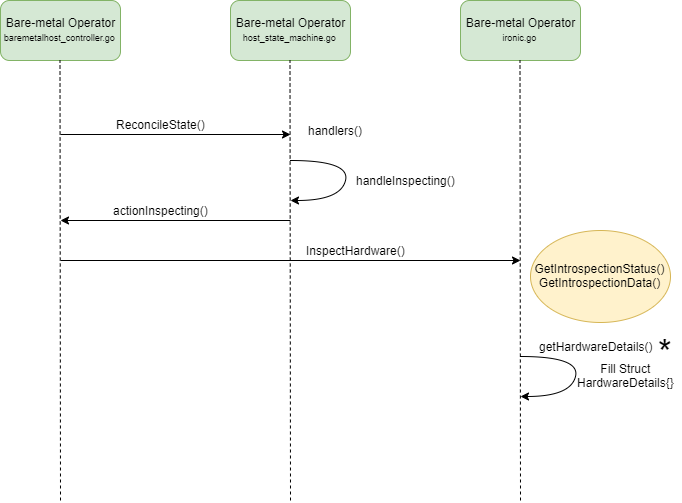

<!--
 This work is licensed under a Creative Commons Attribution 3.0
 Unported License.

 http://creativecommons.org/licenses/by/3.0/legalcode
-->

# Proposal to add BOOT parameter in the metal3 schema

## Table of Contents

<!--ts-->
   * [Proposal to add BOOT parameter in the metal3 schema](#title)
      * [Table of Contents](#table-of-contents)
      * [Summary](#summary)
      * [Motivation](#motivation)
         * [Goals](#goals)
      * [Proposal](#proposal)
         * [Implementation Details/Notes/Constraints](#implementation-detailsnotesconstraints)
         * [Risks and Mitigations](#risks-and-mitigations)
      * [Design Details](#design-details)
         * [Work Items](#work-items)
         * [Dependencies](#dependencies)
         * [Test Plan](#test-plan)
      * [References](#references)
<!--te-->

## Summary

Enhancing the `metal3` schema by adding `BOOT` parameters that we received 
from ironic introspection which will be helpful in performance based use cases.

## Motivation

To make the existing `metal3` schema compatible and scalable for heavy computation 
based use cases.  

### Goals

To compare the introspection data fetched from `Ironic-Inspector` through 
`Gopher-cloud client` library with `metal3` schema and add `BOOT` parameters 
in `metal3` schema.

## Proposal

The comparison of hardware introspection data coming from `Ironic-Inspector` 
and existing `metal3` schema for configuration of `baremetalhost` concludes 
that few hardware parameters are missing in `metal3` schema that are fetched 
from `Ironic-Inspector`. We propose to add `BOOT` parameters in `metal3` schema for 
scalability and performance enhancement.

### Implementation Details/Notes/Constraints

Link for Existing `Metal3` Specs

Please refer `metal3` spec for bare-metal:
https://github.com/metal3-io/baremetal-operator/blob/master/deploy/crds/metal3.io_baremetalhosts_crd.yaml

The investigation of the existing schema indicates that BareMetal-Operator 
gets BareMetal node introspection data using an API call to `Ironic-Inspector` 
through `gopher-cloud client` library. 

Having fetched BareMetal Node introspection data from Ironic-Inspector and
compared it with BareMetalHost schema of `metal3` `(metal3.io_baremetalhosts_crd.yaml`), 
we recommend following parameters need to be added in schema of `metal3`.
1. Add enhancement in the existing `metal3` schema for the following parameters:

    Boot Parameters:
    
    * current_boot_mode: `uefi`
        
        UEFI is installed when device is manufactured. It is the first program which runs when the device is turned on. UEFI replace BIOS.
    * pxe_interface: `ff:ff:ff:ff:ff:ff`
        
        The boot interface manages booting of both the deploy ramdisk and user interfaces on bare metal node. PXE boot interface is generic and works with all hardware that supports booting from network.
    
    Declarative design idea:
    ````yaml
    boot:
        properties:
            current_boot_mode:
                type: string
                description: current boot mode
            pxe_interface:
                type: string
                description: pxe boot interface supports booting from network
        type: object
        required:
        - current_boot_mode
        - pxe_interface
     ````
2. Enhance struct in `baremetalhost_types.go` to store values for additional proposed parameters.
    ````yaml
    
    type Boot struct {
        CurrentBootMode string `json:"currentBootMode"`
        PxeInterface string `json:"pxeInterface"`
    }
    ````
3. Changes in ironic.go:

* Add new function `getBootDetails()` which will get details like `CurrentBootMode` and `PxeInterface` 
and it will be called in `getHardwareDetails()` function.

### Risks and Mitigations

None

## Design Details



*The changes are illustrated  in Implementation Details section.

### Work Items

1. Introduce new section called `boot` under `hardware` in schema `metal3.io_baremetalhosts_crd.yaml`.
2. Define structure for `boot` parameters in `baremetalhosts_types.go`.
3. Fetch `boot` details from `Ironic` and update boot structure.
4. Write unit tests for above implementation.

### Dependencies

Ironic

### Test Plan
 
1. Unit test will be implemented.
2. Functional testing will be performed.
3. Deployment & integration testing will be done.

## References

* https://github.com/metal3-io
* https://github.com/metal3-io/baremetal-operator/blob/master/deploy/crds/metal3.io_baremetalhosts_crd.yaml
