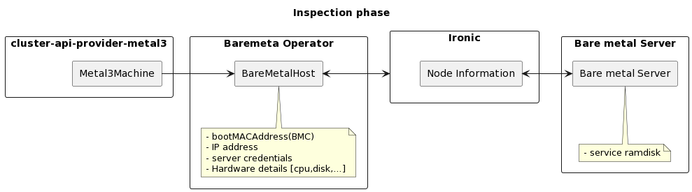

<h1>Bare Metal Operator</h1>

The Bare Metal Operator (BMO) is a custom Kubernetes controller that deploys baremetal hosts, represented in Kubernetes by BareMetalHost (BMH), as Kubernetes nodes. To this end Ironic is used.

The BMO controller is responsible for the following:

- Inspect the host’s hardware details and report them on the corresponding BareMetalHost. This includes information about CPUs, RAM, disks, NICs, and more.
- Provision hosts with a desired image.
- Clean a host’s disk contents before or after provisioning

The BareMetalHost represents a bare metal host (server). The BareMetalHost contains information about the server as shown below. For brevity, some part of the output are omitted, but we can classify the fields into the following broad categories.

1. known server properties: Fields such as `bootMACAddress` properties of the server and are known in advance.
2. unknown server properties: Fields such as `CPU` and `disk` are properties of the server and are discovered by Ironic.
3. user supplied: Fields such as `image` are supplied by user to dictate boot image for the server.
4. dynamic fields: Fields such as IP could be dynamically assigned to the server at run time by DHCP server.

During the life cycle of a bare metal host, upgrade is one example, some of these fields change with information coming from Ironic or other controllers while fields, such as MAC address, do not change (upgrade is one example).

BMO can also work with the Cluster API Provider Metal3 (CAPM3) controller. With the involvement of CAPM3 and Ironic, a simplified information flow path and an overview of the BareMetalHost resource is shown below:

```yaml
apiVersion: metal3.io/v1alpha1
kind: BareMetalHost
metadata:
  name: node-0
  namespace: metal3
spec:
  bmc:
    address: ipmi://192.168.111.1:6230
    credentialsName: node-0-bmc-secret
  bootMACAddress: 00:5a:91:3f:9a:bd
  image:
    checksum: http://172.22.0.1/images/CENTOS_8_NODE_IMAGE_K8S_v1.22.2-raw.img.md5sum
    url: http://172.22.0.1/images/CENTOS_8_NODE_IMAGE_K8S_v1.22.2-raw.img
  networkData:
    name: test1-workers-tbwnz-networkdata
    namespace: metal3
  online: true
  userData:
    name: test1-workers-vd4gj
    namespace: metal3
status:
  hardware:
    cpu:
      arch: x86_64
      count: 2
    hostname: node-0
    nics:
    - ip: 172.22.0.73
      mac: 00:5a:91:3f:9a:bd
      name: enp1s0
    ramMebibytes: 4096
    storage:
    - hctl: "0:0:0:0"
      name: /dev/sda
      serialNumber: drive-scsi0-0-0-0
      sizeBytes: 53687091200
      type: HDD
```

It would help to use an example to describe what BMO does. There are two operations of interest, getting hardware details of the server and  booting the server with a given image, including user supplied cloud-init data. The BareMetalHost resource contains address and authentication information towards a server.

BMO communicates this information to Ironic and gets hardware details (a.k.a. inspection data), such as CPU and disk, of the server in return. This information is added to the BareMetalHost resource status. In order to get such server related information, the server is booted with service ramdisk.
If there are hardware related changes, the BareMetalHost is updated accordingly.

The following diagrams ilustrates the information flow and components involved. From the left, the first two boxes represent Kubernetes custom controllers reconciling the custom resources shown inside. The comments, in yellow, show some relevant fields in these resources.

The right most box represents the bare metal server on which the inspection is done, Operating system is installed and bootstrap script is run. And, the third box shows Ironic which synchronizes the information about the Bare Metal server between the two sides.



Next, with the information coming from the CAPM3 side, the BareMetalHost is updated with image and cloud-init data. That information is also conveyed to Ironic and the server is booted accordingly.

This happens for example when the user scales a MachineDeployment so that the server should be added to the cluster, or during an upgrade when it must change the image it is booting from.


The information flow and operations described above are a bit simplified. CAPM3 provides more data and there are other operations, such as disk cleaning, on the Ironic side as well. However, the overall process remains the same. BMO keeps the server and BareMetalHost resource in sync.

To this end, it takes the server as a source of truth for some fields, such as Hardware details. For other fields, such as Boot image, it takes the information from CAPM3 as a source of the truth and does the sync accordingly.
