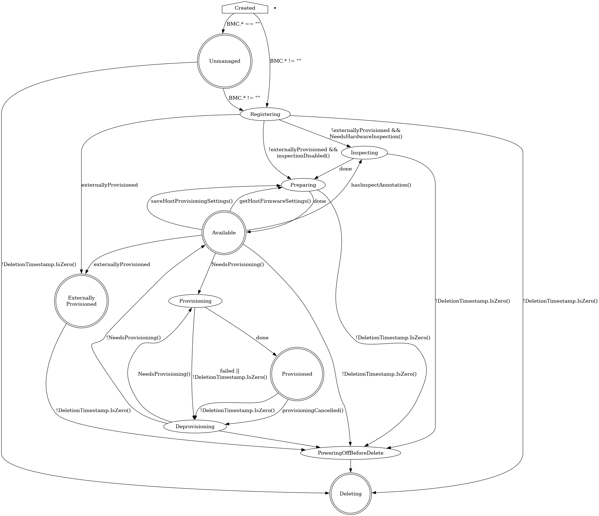

# Host State Machine

During its lifetime, a `BareMetalHost` resource goes through a series of
various states. Some of them are *stable* (the host stays in them indefinitely
without user input), some are *transient* (the state will change once a certain
operation completes). These fields in the `status` resource define the current
state of the host:

- `status.provisioning.state` -- the current phase of the provisioning process.
- `status.operationHistory` -- the history of the main provisioning phases:
  registration, inspection, provisioning and deprovisioning.
- `status.operationalStatus` -- the overall status of the host.
- `status.errorType` -- the type of the current error (if any).
- `status.poweredOn` -- the current power state of the host.

This is how the status of a healthy provisioned host may look like:

```yaml
status:
 # ...
 operationHistory:
    deprovision:
      end: null
      start: null
    inspect:
      end: "2024-06-17T13:09:07Z"
      start: "2024-06-17T13:03:54Z"
    provision:
      end: "2024-06-17T13:11:18Z"
      start: "2024-06-17T13:09:26Z"
    register:
      end: "2024-06-17T13:03:54Z"
      start: "2024-06-17T12:54:18Z"
  operationalStatus: OK
  poweredOn: true
  provisioning:
    ID: e09032ea-1b7d-4c50-bfcd-b94ff7e8d431
    bootMode: UEFI
    image:
      checksumType: sha256
      checksum: http://192.168.0.150/SHA256SUMS
      format: qcow2
      url: http://192.168.0.150/jammy-server-cloudimg-amd64.img
    rootDeviceHints:
      deviceName: /dev/sda
    state: provisioned
 # ...
```

## OperationalStatus

- `OK` -- the host is healthy and operational.
- `discovered` -- the host is known to Metal3 but lacks the required
  information for the normal operation (usually, the BMC credentials).
- `error` -- error has occurred, see the `status.errorType` and
  `status.errorMessage` fields for details.
- `delayed` -- cannot proceed with the provisioning because the maximum number
  of the hosts in the given state has been reached.
- `detached` -- the host is detached, no provisioning actions are possible
  (see [detached annotation](./detached_annotation.md) for details).

## Provisioning state machine



## Provisioning states

### Creating

Newly created hosts get an empty provisioning state briefly before moving
either to `unmanaged` or `registering`.

### Unmanaged

An `unmanaged` host is missing both the BMC address and credentials
secret name, and does not have any information to access the BMC
for registration.

The corresponding operational status is `discovered`.

### Externally Provisioned

An `externally provisioned` host has been deployed using another tool. Hosts
reach this state when they are created with the `externallyProvisioned` field
set to `true`. Hosts in this state are monitored, and only their power status
is managed.

### Registering

The host will stay in the `registering` state while the BMC access details are
being validated.

### Inspecting

After the host is registered, an IPA ramdisk will be booted on it.  The agent
collects information about the available hardware components and sends it back
to Metal3. The host will stay in the `inspecting` state until this process is
completed.

### Preparing

When setting up RAID or changing firmware settings, the host will be in
`preparing` state.

### Available

A host in the `available` state is ready to be provisioned. It will move to the
`provisioning` state once the `image` field is populated.

### Provisioning

While an image is being copied to the host, and the host is configured
to run the image, the host will be in the `provisioning` state.

### Provisioned

After an image is copied to the host and the host is running the
image, it will be in the `provisioned` state.

### Deprovisioning

When the previously provisioned image is being removed from the host,
it will be in the `deprovisioning` state.

### Powering off before delete

When the host that is not currently `unmanaged` is marked to be deleted, it
will be powered off first and will stay in the `powering off before delete`
until it's done or until the retry limit is reached.

### Deleting

When the host is marked to be deleted and has been successfully powered off, it
will move from its current state to `deleting`, at which point the resource
record is deleted.
