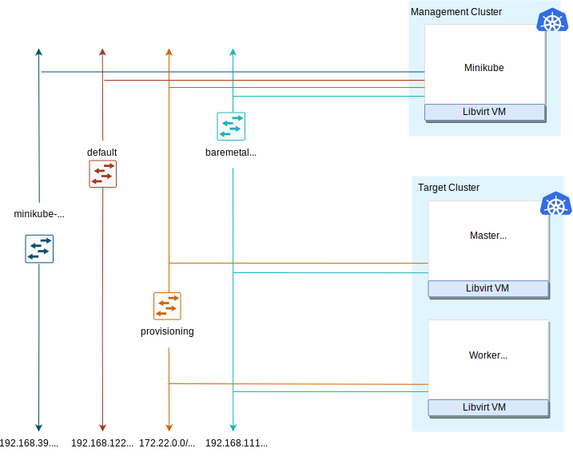

# Getting started with Metal3

 Ready to start taking steps towards your first experience with metal3? Follow these commands to get started!

- [1. Environment Setup](#1-environment-setup)
  - [1.1. Prerequisites](#11-prerequisites)
  - [1.2. Setup](#12-setup)
  - [1.3. Tear Down](#13-tear-down)
  - [1.4. Using Custom Image](#14-using-custom-image)
  - [1.5. Setting environment variables](#15-setting-environment-variables)
- [2. Working with Environment](#2-working-with-environment)
  - [2.1. BareMetalHosts](#21-baremetalhosts)
  - [2.2. Provision Cluster and Machines](#22-provision-cluster-and-machines)
  - [2.3. Deprovision Cluster and Machines](#23-deprovision-cluster-and-machines)
  - [2.4. Running Custom Baremetal-Operator](#24-running-custom-baremetal-operator)
  - [2.5. Running Custom Cluster API Provider Metal3](#25-running-custom-cluster-api-provider-metal3)
    - [Tilt development environment](#tilt-development-environment)
  - [2.6. Accessing Ironic API](#26-accessing-ironic-api)

---

## 1. Environment Setup

> **_info:_** "Naming"
> For the v1alpha3 release, the Cluster API provider for Metal3 was renamed from
> Cluster API provider BareMetal (CAPBM) to Cluster API provider Metal3 (CAPM3). Hence,
> from v1alpha3 onwards it is Cluster API provider Metal3.

### 1.1. Prerequisites

- System with CentOS 9 Stream or Ubuntu 22.04
- Bare metal preferred, as we will be creating VMs to emulate bare metal hosts
- Run as a user with passwordless sudo access
- Minimum resource requirements for the host machine: 4C CPUs, 16 GB RAM memory

### 1.2. Setup

> **_info:_** "Information"
> If you need detailed information regarding the process of creating a Metal³ emulated environment using metal3-dev-env, it is worth taking a look at the blog post ["A detailed walkthrough of the Metal³ development environment"]().

This is a high-level architecture of the Metal³-dev-env. Note that for an Ubuntu-based setup, either Kind or Minikube can be used to instantiate an ephemeral cluster, while for a CentOS-based setup, only Minikube is currently supported. The ephemeral cluster creation tool can be manipulated with the EPHEMERAL_CLUSTER environment variable.

 

The short version is: clone [metal³-dev-env](https://github.com/metal3-io/metal3-dev-env)
and run

```console
 make
```

The `Makefile` runs a series of scripts, described here:

- `01_prepare_host.sh` - Installs all needed packages.

- `02_configure_host.sh` - Creates a set of VMs that will be managed as if they
  were bare metal hosts. It also downloads some images needed for Ironic.

- `03_launch_mgmt_cluster.sh` - Launches a management cluster using `minikube` or `kind`
  and runs the `baremetal-operator` on that cluster.

- `04_verify.sh` - Runs a set of tests that verify that the deployment was completed successfully.

When the environment setup is completed, you should be able to see the `BareMetalHost` (`bmh`) objects in the Ready state.

### 1.3. Tear Down

To tear down the environment, run

```console
 make clean
```

> info "Note"
> When redeploying metal³-dev-env with a different release version of CAPM3, you
> must set the `FORCE_REPO_UPDATE` variable in `config_${user}.sh` to _true_.
> warning "Warning"
> If you see this error during the installation:
>
> ```console
> error: failed to connect to the hypervisor \
> error: Failed to connect socket to '/var/run/libvirt/libvirt-sock':  Permission denied
> ```
>
> You may need to log out then log in again, and run `make clean` and `make` again.

### 1.4. Using Custom Image

Whether you want to run target cluster Nodes with your own image, you can override the three following variables: `IMAGE_NAME`,
`IMAGE_LOCATION`, `IMAGE_USERNAME`. If the requested image with the name `IMAGE_NAME` does not
exist in the `IRONIC_IMAGE_DIR` (/opt/metal3-dev-env/ironic/html/images) folder, then it will be automatically
downloaded from the `IMAGE_LOCATION` value configured.

### 1.5. Setting environment variables

> info "Environment variables"
> More information about the specific environment variables used to set up metal3-dev-env can be found [here](https://github.com/metal3-io/metal3-dev-env/blob/master/vars.md).

To set environment variables persistently, export them from the configuration file used by metal³-dev-env scripts:

```bash
 cp config_example.sh config_$(whoami).sh
 vim config_$(whoami).sh
```
