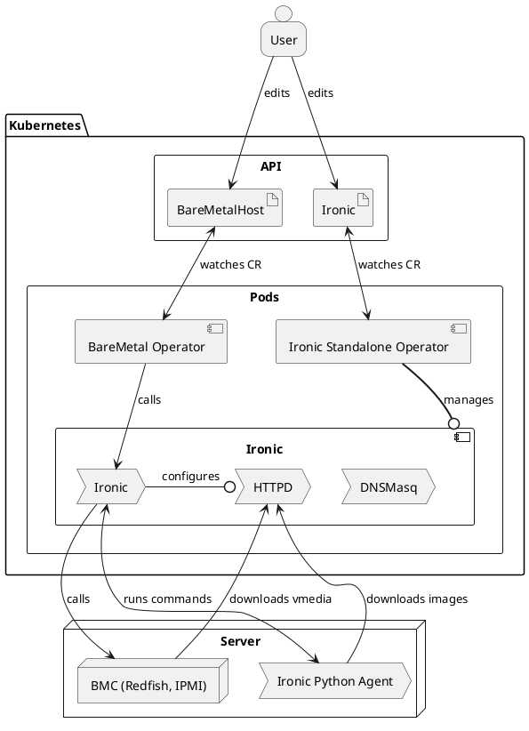

# Ironic

[Ironic](https://ironicbaremetal.org/) is an open-source service
for automating provisioning and lifecycle management of bare metal machines.
Born as the Bare Metal service of the [OpenStack](https://www.openstack.org/)
cloud software suite, it has evolved to become a semi-autonomous project,
adding ways to be deployed independently as a standalone service, for example
using [Bifrost](https://docs.openstack.org/bifrost/latest/), and integrates in
other tools and projects, as in the case of [Metal3](https://metal3.io/).

Ironic nowadays supports the two main standard hardware management interfaces,
[Redfish](https://www.dmtf.org/standards/redfish) and
[IPMI](https://en.wikipedia.org/wiki/Intelligent_Platform_Management_Interface),
and thanks to its large community of contributors, it can provide native
support for many different bare-metal hardware vendors, such as Dell, Fujitsu,
HPE, and Supermicro.

The Metal3 project adopted Ironic as the back-end that manages bare-metal hosts
behind native Kubernetes API.

## Why Ironic in Metal3

- Ironic is open source! This aligns perfectly with the philosophy behind
  Metal3.
- Ironic has a vendor agnostic interface provided by a robust set of RESTful
  APIs.
- Ironic has a vibrant and diverse community, including small and large
  operators, hardware and software vendors.
- Ironic provides features covering the whole hardware life-cycle:
  from bare metal machine registration and hardware specifications
  retrieval of newly discovered bare metal machines, configuration and
  provisioning with custom operating system images, up to machines reset,
  cleaning for re-provisioning or end-of-life retirement.

## How Metal3 uses Ironic

[Bare Metal Operator](https://github.com/metal3-io/baremetal-operator)
is the main component that interfaces with the Ironic API for all
operations needed to provision bare-metal hosts, such as hardware capabilities
inspection, operating system installation, and re-initialization when
restoring a bare-metal machine to its original status.

Metal3 provides [a way to install Ironic](../irso/introduction.md) with a
suitable configuration. Alternatively, Bare Metal Operator can be set up to use
an externally managed Ironic instance.

### Components overview

### Requirements for external Ironic

- HTTP basic authentication (OpenStack Identity is not supported - see [issue
  1218](https://github.com/metal3-io/baremetal-operator/issues/1218)).
- Enabled hardware types and interfaces that match the supported Metal3 drivers
  (at least the ones you intend to use).
- [API version](https://docs.openstack.org/ironic/latest/contributor/webapi-version-history.html)
  1.81 (2023.1 "Antelope" release cycle) or newer must be available.
- Built-in in-band inspection (ironic-inspector is no longer supported).
- Deploy interface `direct` enabled and used by default.
- No-op network interface (OpenStack Networking is not supported).

Optionally:

- Automated cleaning set to metadata only.
- Deploy interfaces `ramdisk` and `custom-deploy` enabled.
- Fast track mode enabled.

### Ironic database

Ironic keeps information in its own database, completely independent from the
Kubernetes data storage. Metal3 treats the Kubernetes database (e.g.
`BareMetalHost` resources) as the authoritative source of information about the
desired state of the machines. On any discrepancies, Bare Metal Operator will
use the Ironic API to enforce the desired state.

By default, Ironic installed by [Ironic Standalone
Operator](../irso/introduction.md) or older [Metal3 deployment
scripts](ironic_installation) used an ephemeral SQLite database for storage.
The data is removed when the Metal3 pod is restarted. When this happens, Bare
Metal Operator will re-create hosts in Ironic and drive them through various
actions to enforce the expected state:

- Hosts in the `provisioned` state will go through
  [adoption](https://docs.openstack.org/ironic/latest/admin/adoption.html)
  without provisioning them again.

- For hosts in the `available` state, only the BMC credentials will be
  verified.

- For hosts in various transient states, Bare Metal Operator will restart the
  action that lead to this state. For instance, a host in the `provisioning`
  state will undergo cleaning, then a new provisioning will be started.

Ironic Standalone Operator can also [install Ironic with
MariaDB](../irso/database.md).

### Host enrollment and hardware inventory

When a `BareMetalHost` is created, Bare Metal Operator tries to find an
existing record in Ironic by its name or MAC address. The name in Ironic is
generated by joining the namespace and the host name with a tilde. For example,
host `compute-0` in the `metal3` namespace will receive the Ironic name
`metal3~compute-0`. If no record is found:

1. A new record is created in Ironic.
1. BMC credentials are verified by Ironic by reading the current power state of
   the machine.
1. The
   [inspection](https://docs.openstack.org/ironic/latest/admin/inspection/index.html)
   process is started.

Once inspection finishes successfully, the hardware inventory is fetched from
Ironic and stored in a corresponding `HardwareData` resource. Note that this
information is never updated unless a new inspection happens (see [inspect
annotation](../bmo/inspect_annotation)).

### Host provisioning

Provisioning is triggered by populating either the `image` or the
`customDeploy` field of the host. Under the hood, three modes of provisioning
are supported:

- When `customDeploy` is provided, Bare Metal Operator will configure the host
  to use the `custom-agent` *deploy interface*. The `method` field will be
  treated as the name of a [custom deploy
  step](https://docs.openstack.org/ironic/latest/admin/node-deployment.html) to
  execute **instead of** the regular provisioning process. Your Ironic
  installation or [IPA image](ironic-python-agent) must contain the
  implementation of this step. By default, Metal3 does not ship any such steps.

- When `customDeploy` is not provided and the `image.diskFormat` field is set
  to `live-iso`, the host will be configured to use the [ramdisk deploy
  interface](https://docs.openstack.org/ironic/latest/admin/ramdisk-boot.html),
  while `image.url` will be treated as a URL of an ISO 9660 image to boot.
  This mode is designed to integrate Metal3 with site-specific installers.

- When `customDeploy` is not provided and the `image.diskFormat` field is not
  set to `live-iso`, the regular provisioning process is followed. The
  IPA-based service ramdisk (normally already booted on the host during
  inspection) will write the downloaded image to the root disk specified by
  the `rootDeviceHints` field.

### Host decommissioning

Each `BareMetalHost` will receive a *finalizer* that prevents this host from
being immediately removed on deletion. Before the finalizer is removed, the
host is:

1. cleaned to remove the partitioning tables from all its disks,
1. powered off to stop it from running the service ramdisk.

The cleaning process is retried several times. If due to a problem with the
host cleaning is no longer possible, disable cleaning first by setting the
`automatedCleanMode` field to `disabled`.

**WARNING:** it is not recommended to manually remove the finalizer when the
cleaning process is taking longer than desired or is failing. Doing so, will
remove the host record from Kubernetes but leave it in Ironic. The currently
running action will continue in the background, and an attempt to add the host
again may fail because of the conflict.

## References

- [Ironic Project Website](https://ironicbaremetal.org/)
- [Ironic Documentation](https://docs.openstack.org/ironic/latest/)
- [Ironic Source Repository on OpenDev.org](https://opendev.org/openstack/ironic/)
